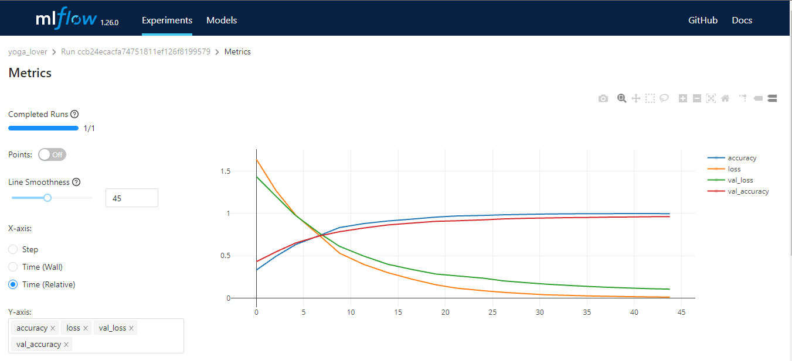
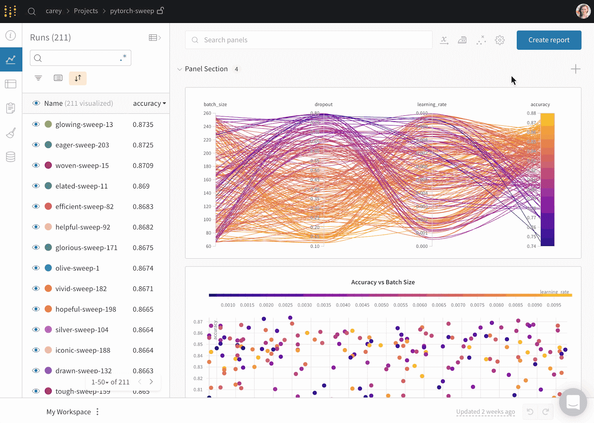
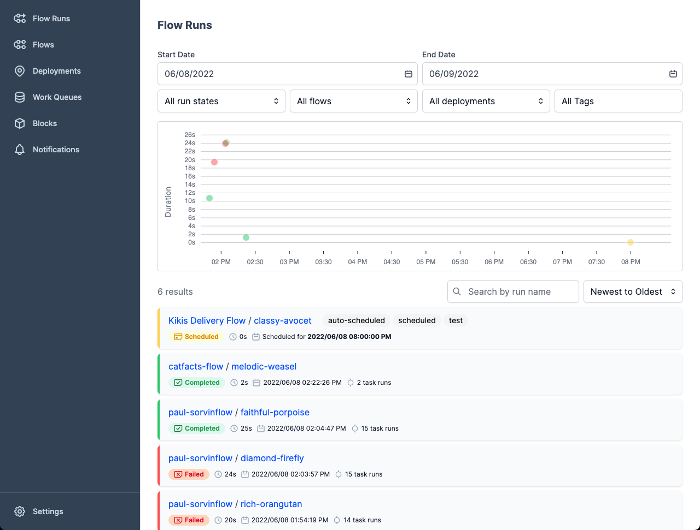
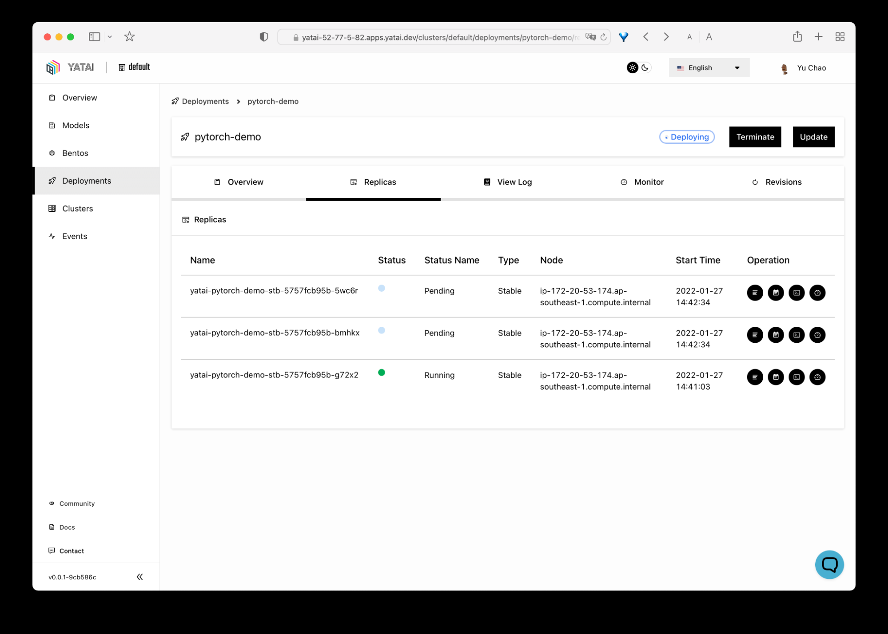
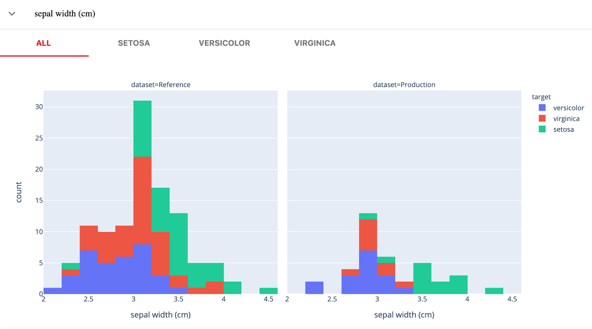

# 1.什么是MLOps？

MLOps是一门工程学科，旨在统一 ML 系统开发（dev）和 ML 系统部署（ops），以标准化过程生产高性能模型的持续交付。[知乎](https://zhuanlan.zhihu.com/p/392216271)

# 2.论文中提到的工具

Machine Learning Operations (MLOps) overview definition and architecture这篇论文中介绍了11个MLOps相关工具，下面挑选开源的和Azure商用的进行总结：

## 2.1 TensorFlow Extended

- 类别：开源
- TFX 是一种基于 TensorFlow 的 Google 生产级机器学习 (ML) 平台。该平台提供了一个配置框架和众多共享库，用来集成定义、启动和监控机器学习系统所需的常见组件。TFX 是一个端到端平台，用于部署生产环境机器学习流水线。TensorFlow Extended（TFX）是一个配置框架，为端到端ML管道的每个任务提供库。例如，有数据验证、数据分布检查、模型训练和模型服务。
- 相关链接：[https://tensorflow.google.cn/tfx?hl=zh-cn](https://tensorflow.google.cn/tfx?hl=zh-cn)

## 2.2 Airflow

- 类别：开源
- Airflow是一种任务和工作流程编排工具，也可以用于ML工作流程编排。它还可用于编排数据工程作业。任务可以根据有向无环图（DAGs）来执行。
- 相关链接：[https://airflow.apache.org/](https://airflow.apache.org/)

## 2.3 Kubeflow ⭐

- 用途：部署
- 类别：开源
- Kubeflow是一个基于kubernetes的端到端ML平台。每个Kubeflow组件都被包装到一个容器中，并由Kubernetes协调。此外，ML工作流管道中的每个任务都用一个容器来处理。Kubeflow项目致力于在Kubernetes上部署机器学习（ML）工作流，简单，可移植和可扩展。我们的目标不是重新创建其他服务，而是提供一种直接的方法，将ML的最佳开源系统部署到不同的基础设施。无论你在哪里运行Kubernetes，你都应该能够运行Kubeflow。
- 相关链接：[https://www.kubeflow.org/](https://www.kubeflow.org/)

## 2.4 MLflow

- 类别：开源
- MLflow是一个ML平台，它允许端到端管理ML生命周期。它提供了一个高级的实验跟踪功能、一个模型注册表和模型服务组件。MLflow是一个开源工具，可帮助您管理机器学习生命周期的核心部分。它通常用于实验跟踪，但您也可以将其用于再现性，部署和模型注册。您可以使用CLI、Python、R、Java和REST API管理机器学习实验和模型元数据。
- 相关链接：[https://mlflow.org/](https://mlflow.org/)
- 

## 2.5 Azure DevOps Pipelines

- 类别：商用
- Azure DevOps管道是一个CI/CD自动化工具，以促进构建、测试和交付步骤。它还允许人们调度和管理一个ML管道的不同阶段。
- 相关链接：[https://learn.microsoft.com/zh-cn/azure/devops/pipelines/?view=azure-devops](https://learn.microsoft.com/zh-cn/azure/devops/pipelines/?view=azure-devops)

## 2.6 Azure ML

- 类别：商用
- 微软的Azure结合了Azure DevOps管道和Azure ML，提供了一个端到端ML平台。

# 三、其他MLOps Tools

在[https://www.datacamp.com/blog/top-mlops-tools](https://www.datacamp.com/blog/top-mlops-tools)中提到了一些其他的MLOps的工具，下面挑选介绍：

## 3.1 Comet ML

- Comet ML是一个跟踪、比较、解释和优化机器学习模型和实验的平台。您可以将其与任何机器学习库一起使用，例如Scikit-learn，Pytorch，TensorFlow和HuggingFace。
- 相关链接：[https://www.comet.com/site/](https://www.comet.com/site/)

## 3.2 Weights & Biases(wandb) ⭐

- 用途：训练结果查看（在线）
- Weights & Biases是一个用于实验跟踪、数据和模型版本控制、超参数优化和模型管理的机器学习平台。此外，您可以使用它来记录工件（数据集、模型、依赖关系、管道和结果）并可视化数据集（音频、视觉、文本和表格）。
- 相关链接：[https://wandb.ai/site](https://wandb.ai/site)
- 

## 3.3 Prefect ⭐

- 用途：工作流管理
- Prefect是一个现代化的数据堆栈，用于监控、协调和编排应用程序之间的工作流。它是一个开源的轻量级工具，专为端到端机器学习管道而构建。您可以使用Prefect Orion UI或Prefect Cloud作为数据库。Prefect Orion UI是一个开源、本地托管的编排引擎和API服务器。它为您提供了对本地Prefect Orion实例和工作流的深入了解。Prefect Cloud是一个托管服务，可让您可视化流程、流程运行和部署。此外，您还可以管理帐户、工作区和团队协作。
- 相关链接：[https://www.prefect.io/](https://www.prefect.io/)
- 

## 3.4 Metaflow

- 用途：工作流管理
- Metaflow是一个强大的，久经考验的工作流管理工具，用于数据科学和机器学习项目。它是为数据科学家构建的，因此他们可以专注于构建模型，而不是担心MLOps工程。

## 3.5 Pachyderm

- 用途：版本控制（没有看出具体用途）
- Pachyderm通过Kubernetes上的数据版本化、沿袭和端到端管道自动化数据转换。您可以与任何数据（图像，日志，视频，CSV），任何语言（Python，R，SQL，C/C++）以及任何规模（PB数据，数千个作业）集成。就像Git一样，你可以使用类似的语法来版本化你的数据。在Pachyderm中，对象的最高级别是Repository，您可以使用Commit、Branches、File、History和Provenance来跟踪和版本化数据集。
- 相关链接：[https://www.pachyderm.com/](https://www.pachyderm.com/)

## 3.6 Data Version Control (DVC) ⭐

- 用途：版本控制，可对数据、模型等进行版本控制
- Data Version Control是一个开源的、流行的机器学习项目工具。它与Git无缝协作，为您提供代码、数据、模型、元数据和管道版本控制。DVC不仅仅是一个数据跟踪和版本控制工具。您可以使用它：实验跟踪（模型指标、参数、版本控制）。创建、可视化和运行机器学习管道。部署和协作的工作流。数据和模型注册表。使用CML持续集成和部署机器学习。
- 相关链接：[https://dvc.org/](https://dvc.org/)

## 3.7 BentoML ⭐

- 用途：模型部署与管理
- BentoML使机器学习应用程序的发布变得更简单、更快。它是一个Python优先的工具，用于在生产中部署和维护API。它通过运行并行推理和自适应批处理来扩展强大的优化功能，并提供硬件加速。BentoML的交互式集中式仪表板可以在部署机器学习模型时轻松组织和监控。最好的部分是它可以与各种机器学习框架一起使用，例如Keras，ONNX，LightGBM，Pytorch和Scikit-learn。简而言之，BentoML为模型部署、服务和监控提供了完整的解决方案。
- 相关链接：[https://www.bentoml.com/](https://www.bentoml.com/)
- 相关链接：[https://github.com/bentoml/bentoml](https://github.com/bentoml/bentoml)
- 

## 3.8 Cortex ⭐

- 用途：模型部署与管理
- Cortex允许您在生产环境中部署、管理和扩展机器学习模型。它是一个开源、灵活、多框架的模型服务和监控工具。Cortex扩展到Docker，Kubernetes，TensorFlow Serving，TorchServe和其他ML库。它通过提供可扩展的端点来管理负载。此外，您可以在单个API端点上部署多个模型，并且它支持用于保护API的自动扩展功能。它是一个MLOps工具，赠款您完全控制模型管理操作。
- 相关链接：[https://www.cortex.dev/](https://www.cortex.dev/)

## 3.9 Evidently ⭐

- 用途：监控
- 开源Python库，用于在开发、验证和生产过程中监控ML模型。它检查数据和模型质量、数据漂移、目标漂移以及回归和分类性能。Evidently有三个主要组成部分：测试（批量模型检查）：用于执行结构化数据和模型质量检查。报告（交互式仪表板）：交互式数据漂移、模型性能和目标虚拟化。实时监控（Real-time monitoring）：监控来自已部署ML服务的数据和模型指标。
- 相关链接：[https://www.evidentlyai.com/](https://www.evidentlyai.com/)
- 

## 3.10 Censius AI

- 模型监控（与Wandb类似）
- 相关链接：[https://censius.ai/](https://censius.ai/)
