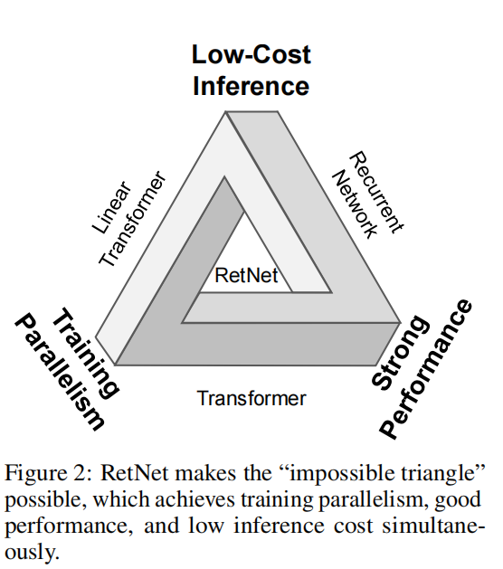
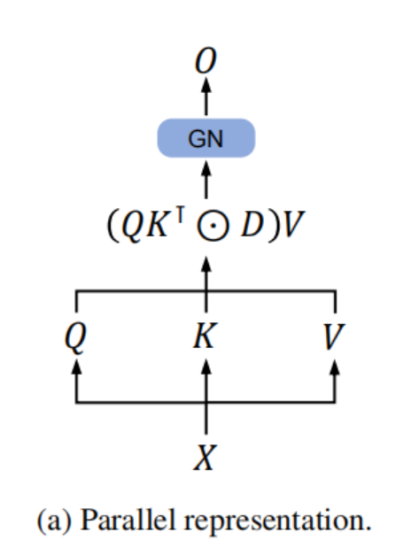
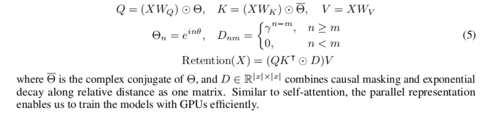

# RETNET 论文笔记

RETNET（全称Retentive Network），是微软研究院和清华大学推出的大语言模型(LLM)基本架构。从论文题目可以看出，RETNET在LLM上要优于Transformer，同时实现了平行训练、低耗费推理和良好表现三大特性。RETNET的理论来源是连接循环和注意力，提出了对序列模型的记忆力机制，这支持三个模式，即：平行、循环和分块循环(chunkwise recurrent)。平行意味着允许平行训练；循环意味着可以在O(1)耗费下推理，这可以在不牺牲性能的情况下提高解码吞吐量、降低延迟和减少GPU内存使用；分块循环意味着便于具有线性复杂度的高效长序列建模，每个chunk都可以并行编码。相关代码见[https://aka.ms/retnet](https://aka.ms/retnet)。

## 1 介绍

现在，Transformer已然成为LLM的首选架构。当时提出Transformer架构是为了克服基于RNN的模型的无法并行训练的问题，然而，Transformer的并行训练是有代价的，即推理时比较低效，因为每个step的复杂度都是O(N)，并且要在内存中缓存key-value。这导致了部署基于Transformer的模型不是很友好，随着序列长度的增加，GPU的内存急剧增加，推理速度急速下降。

因此，也有很多人在努力，希望**提出一个在保持平行训练和良好表现的前提下，能够实现具有O(1)复杂度的推理的架构**。这是很难的，即所谓“不可能三角”：

RETNET则可以同时实现低成本推理、高效长序列建模、和Transformer相似的性能和并行训练。具体来说，作者提出了多尺度保留机制(multi-scale retention mechanism)代替多头注意力(multi-head attention)。它有三种计算范式，即并行、循环和块递归表示。首先，并行表示使训练并行性能够充分利用GPU设备。其次，递归表示能够在内存和计算方面实现有效的O (1)推断。可以显著降低部署成本和延迟。此外，该实现比较简单，没有键值缓存。第三，分块的循环表示可以执行有效的长序列建模。作者对每个本地块进行并行编码以提高计算速度，同时递归地编码全局块以节省GPU内存。

语言模型的实验结果表明，RetNet在尺度曲线和上下文学习方面都具有竞争力。此外，RetNet的**推理耗费是不受序列长度影响**的。对于7B型号和8k序列长度，**RetNet的解码速度比具有键值缓存的Transformer快8.4倍，节省了70%的内存**。在训练过程中，RetNet还比使用了FlashAttention的Transformer节省了25-50%的内存，提升了7倍的速度。此外，RetNet的**推理延迟对batch size不敏感，允许巨大的吞吐量**。这些特性使RetNet可以成为大型语言模型的Transformer的强大继承者。

## 2 Retentive Networks

RETNET由L个相同的block组成，与Transformer相似（residual connection, and pre-LayerNorm）。每个RETNET block包括两个模块：**多尺度保留模块**(multi-scale retention, MSR)和**前馈网络**(feed-forward network, FFN)模块。

具体可表示为：给定一个输入序列$x = x_1 ... x_{|x|}$，RETNET通过自回归的方式编码这个序列。输入向量$\{x_i\}^{x}_{i=1}$首先被转换为$X^0 = [x_1, ... x_{|x|}] ∈ \Bbb{R}^{|x| × d_{model}}$（$d_{model}$是隐层维数），说白了应该是这样形状的矩阵：

$$
\begin{bmatrix}
   x_{11} & ... & x_{1,|x|} \\
   ... & ... & ... \\
   x_{d_{model},1} & ... & x_{d_{model},|x|}
\end{bmatrix}
$$

然后，一层一层地计算：$X^l = RetNet_l(X^{l-1}), l ∈ [1, L]$。

### 2.1 Retention

给定输入$X ∈ \Bbb{R}^{|x| × d_{model}}$，我们把它投影到一维函数$v(n) = X_n · w_V$上，现在，通过状态$s_n$来把$v(n)$映射到$o(n)$上，为了简化，我们规定$v_n = v(n), o_n = o(n)$那么有：

$$
s_n = As_{n-1} + K_n^Tv_n,
$$

$$
其中A ∈ \Bbb{R}^{d×d},K_n ∈ \Bbb{R}^{1×d}, K^T表示K的转置
$$

$$
o_n = Q_ns_n = \sum_{m=1}^nQ_nA^{n-m}K_m^Tv_m,
$$

$$
其中Q_n ∈ \Bbb{R}^{1×d}
$$

（上面两个等式称为(1)）

【注：这个Q和K，应该指的是Query和Key，即Q K V中的】

接下来，我们使用投影$Q_n, K_n$进行内容感知：

$$
Q = XW_Q, K = XW_K
$$

（上面的等式称为(2)）

这里的$W_Q, W_K$指的是可学习的矩阵。

下面，我们把矩阵$A$对角化：$A = \varLambda(\gamma e^{iθ})\varLambda^{-1}$，这里的$\gamma, θ ∈ \Bbb{R}^d$。这样我们可以得到$A^{n-m} = \varLambda(\gamma e^{iθ})^{n-m}\varLambda^{-1}$。通过吸收$\varLambda$到$W_Q, W_K$中，我们可以重写(1)式：

$$
o_n = \sum_{m=1}^nQ_n(\gamma e^{iθ})^{n-m}K_m^Tv_m
$$

$$
= \sum_{m=1}^n(Q_n(\gamma e^{iθ})^n)(K_m(\gamma e^{iθ})^{-m})^Tv_m
$$

（上面的等式称为(3)）

其中，$Q_n(\gamma e^{iθ})^n, K_m(\gamma e^{iθ})^{-m}$称为[xPos](https://arxiv.org/abs/2212.10554)，这是Transformer的相对位置embedding。我们进一步地把$\gamma$简化为一个标量，等式(3)变为：

$$
o_n = \sum_{m=1}^n\gamma^{n-m}(Q_ne^{inθ})(K_me^{imθ})^{\dag}v_m
$$

其中$\dag$表示共轭转置。该公式在训练实例中很容易被并行化。

**Retention的平行表示**。Retention Layer结构图如下：

Layer的定义如下：

与自注意力类似，并行表示使能够有效地用GPU训练模型。

**Retention的循环表示**。
