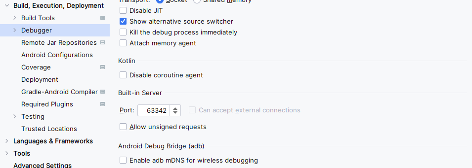

在新设备上安装了Android Studio，不过其自带的adb一直处于无法使用的状态，因为它处于无限重启状态，每隔几秒钟就会重启一次，导致无法持续连接Android设备。这段时间一直采用在Android Studio启动之前手动启动一个adb程序来临时解决，不过这种办法很不方便。

## 解决过程

首先通过Android Studio的菜单->Help->Show Log in Explorer选项打开Android Studio的日志文件夹，找到idea.log文件并打开，发现日志中有关adb的日志如下：

```
2023-10-10 14:27:43,703 [  57399]   WARN - #com.android.ddmlib - Cannot reach ADB server, attempting to reconnect.
```

这个问题可以通过Android Studio的菜单->File->Settings，找到Build, Execution, Deployment选项中的Debugger，然后取消勾选Enable adb mDNS for wireless debugging来解决。


