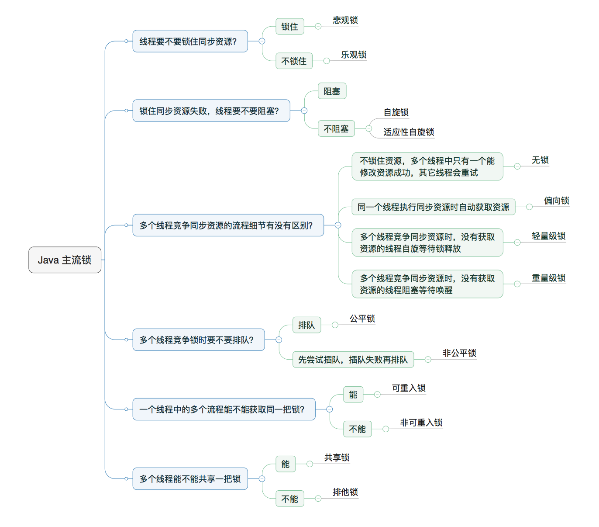

总结于[文章1](https://zhuanlan.zhihu.com/p/71156910) [文章2](https://tech.meituan.com/2018/11/15/java-lock.html)

## 0.Java中的两种锁

- synchronized，关键字，在jvm中实现
- Lock，一个接口

### 0.1 synchronized

synchronized是Java中的一个关键字

它是一个悲观锁，它涉及了一些锁升级的概念。

- 在最开始时，synchronized是偏向锁，即它更加偏向于第一个获取到这个锁的线程。如果说下一次执行到同步语句，发现还是这个线程，那么synchronized就不需要重新加锁了，这样只有一个线程的话，就不需要频繁加锁，性能开销基本没有。
- 如果某时刻又来了一个线程，那么此时的偏向锁就会升级为轻量锁。轻量级锁是一个自旋锁，如果现在有两个线程A和B，那么A在执行的时候，B此时会自旋等待，即不会暂停执行。这个自旋等待次数是有上限的，一旦到达了某个上限，就会升级为重量级锁，此时没有争夺到锁的线程就会暂停执行，让出CPU，直到通知它再次执行。

### 0.2 ReentrantLock

ReentrantLock是可重入锁，默认是非公平锁。

这里主要说一下它是如何可重入的。

ReentrantLock里面有个内部类Sync和它的两个子类FairSync和NonFairSync，对应着公平锁和非公平锁的实现。

如何实现可重入的，我们看Sync#tryLock()：

```java
final boolean tryLock() {
    Thread current = Thread.currentThread();
    int c = getState();
    //如果state值为0，表示这个锁没有被任何线程占用，通过CAS将state改为1
    //（因为可能有多个线程同时争夺）
    if (c == 0) {
        if (compareAndSetState(0, 1)) {
	    //如果争夺成功，那么把这个锁的拥有者设置为当前线程
	    //这样可以保证下次重入
            setExclusiveOwnerThread(current);
            return true;
        }
    }
    //如果发现state不为1，且拥有者是本线程，表示重入 
    else if (getExclusiveOwnerThread() == current) {
        if (++c < 0) // overflow
	    throw new Error("Maximum lock count exceeded");
        setState(c);
        return true;
    }
    return false;
}
```

可以看到重入的关键就是AQS中维护了state变量和所有者线程值。每重入一层，state就会加1



### 0.3 synchronized和ReentrantLock区别

- s可以修饰代码块、方法，R只可修饰方法
- s是JVM层面实现的，R是实现了Lock接口，在Java层面实现的
- s是非公平锁，R是默认非公平锁，可选公平锁
- s是通过JVM中监视器来实现加锁解锁，R是通过AQS

## 1.乐观锁和悲观锁

对于乐观锁来说，它会认为每次读取都不会有其他线程去修改，就直接读就可以了。对于写的时候，它会比较当前值是否是期待值，如果是，则表明可能没有其他线程修改，就进行修改，否则则循环等待下次修改。

对于悲观锁来说，它认为每次读取都会有人修改，所以就在读取之前都加锁。这样在竞争激烈的情况下可能导致性能下降。

乐观锁更加适合读多写少的情况，而悲观锁更适合写多的情况

### 1.1 乐观锁有什么问题？

乐观锁一般使用CAS来实现。

使用CAS时，可能会有三个问题：

- 可能会导致ABA问题，即其他线程把数据从A修改到B，又从B修改到A，这时我们的线程是发现不了数据变化的
- 在写多的场景下，CAS会频繁失败然后循环等待，这时也是比较耗时的。
- CAS只能保证单个共享变量的原子性，没办法保证多个共享变量的原子性

### 1.2 Java中哪些实现是悲观锁，哪些是乐观锁

Java中，无论是synchronized还是Lock接口，都是悲观锁。

Java中乐观锁可以使用Unsafe的CAS，还有一些原子类都是乐观锁

## 2.自旋锁

自旋锁就是一个线程在CPU执行时，发现同步资源是上锁的，此时不必让出CPU，而是在CPU中自旋等待，等待到同步资源解锁直接开始执行就可以了。

因为自旋锁不会让出CPU，等待线程会在CPU中无用的自旋操作，所以会有一定的上限，如果自旋次数超过某个数量，就不再自旋了。

此外，后面还引入了自适应自旋锁，即自旋次数不再固定，而是根据历史的自旋次数等因素来动态决定。

## 3.公平锁和非公平锁

- 公平锁：按照线程队列的顺序来获取锁，只有队头的线程才可以获得锁
- 非公平锁：队列中的线程都可以竞争锁，会出现后来的线程却先得到锁的情况，也可以不进队列直接执行。**非公平锁可以提高性能，因为有时候线程不必经历暂停-恢复的过程**，但是可能出现线程饿死的情况。

**公平锁就是线程直接进入阻塞队列，直到成为队列的第一个，才可以获得锁。非公平锁就是多个线程加锁时直接尝试上锁，上锁成功直接执行，失败进入阻塞队列。**

ReentrantLock默认的实现就是非公平锁。**它其中有一个Sync类，继承了AQS**，它有两个子类FairSync和NonfairSync，对应着公平锁和非公平锁。

## 4.可重入锁，非可重入锁

**可重入锁又叫递归锁，就是如果一个线程在外部方法已经获取了锁，那么在进入内部方法时，会自动获得锁，而不会被阻塞**。

可重入锁可以防止死锁。

synchronized和ReentrantLock都是可重入锁。

## 5.共享锁和排他锁

共享锁就是多个线程可同时持有一把锁，排他锁就是同时只可有一个线程获得一把锁。

**某个同步资源加了共享锁，那么其他线程也只能加共享锁，不能加排他锁，而且共享锁只能读数据，不能写数据。**
