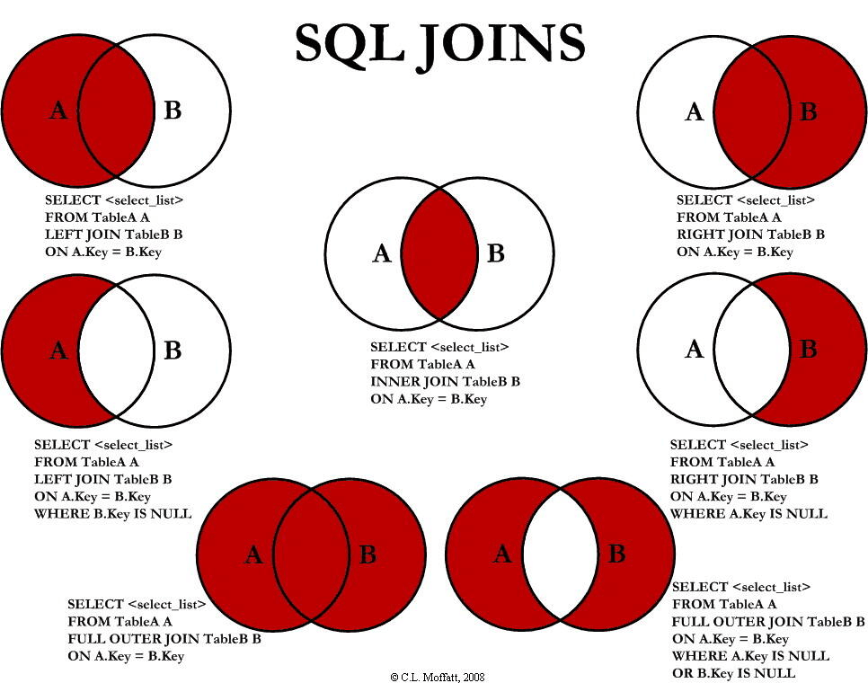

MySQL中的join种类可以分为以下几种：

- 内连接
- 外连接
- 交叉连接

一个比较常见的图是下面的这张，看完即懂：



根据上面的三种连接，我们分别做介绍。

为了方便演示，我们选择[力扣的175题](https://leetcode.cn/problems/combine-two-tables/description/)作为背景：

表: `Person`

```
+-------------+---------+
| 列名         | 类型     |
+-------------+---------+
| PersonId    | int     |
| FirstName   | varchar |
| LastName    | varchar |
+-------------+---------+
personId 是该表的主键（具有唯一值的列）。
该表包含一些人的 ID 和他们的姓和名的信息。
```

表: `Address`

```
+-------------+---------+
| 列名         | 类型    |
+-------------+---------+
| AddressId   | int     |
| PersonId    | int     |
| City        | varchar |
| State       | varchar |
+-------------+---------+
addressId 是该表的主键（具有唯一值的列）。
该表的每一行都包含一个 ID = PersonId 的人的城市和州的信息。
```

数据如下：

```
Person表:
+----------+----------+-----------+
| personId | lastName | firstName |
+----------+----------+-----------+
| 1        | Wang     | Allen     |
| 2        | Alice    | Bob       |
+----------+----------+-----------+
Address表:
+-----------+----------+---------------+------------+
| addressId | personId | city          | state      |
+-----------+----------+---------------+------------+
| 1         | 2        | New York City | New York   |
| 2         | 3        | Leetcode      | California |
+-----------+----------+---------------+------------+
```

## 1.内连接

内连接(inner join)找的是两张表的交集。比如上面的例子中，查询结果如下：

```sql
select p.FirstName as firstName, p.LastName as lastName, a.City as city, a.State as state
from Person p
inner join Address a on p.personId = a.personId;
```

结果：

```sql
| firstName | lastName | city          | state    |
| --------- | -------- | ------------- | -------- |
| Bob       | Alice    | New York City | New York |
```

对于inner join，可以省略为join，即join表示的就是inner join。

## 2.外连接

外连接找的是两张表的交集+某张表/两张表的不满足内容。在MySQL中，外连接有三种：

- 全外连接
- 左连接
- 右连接

### 2.1 全外连接

全外连接 full outer join可以表示两张表的并集，不过我们使用MySQL时，是没有 `full join`或者 `full outer join`的，因为MySQL并不支持，所以我们可以考虑使用 `left join`等方式实现。

### 2.2 左连接

左连接找的是两张表的交集和左表（where 中的那张表）的全内容，即，左表全表返回，右表予以匹配，无匹配则为NULL。

对于上面的例子，查询结果如下：

```sql
select p.FirstName as firstName, p.LastName as lastName, a.City as city, a.State as state
from Person p
left join Address a on p.personId = a.personId;
```

结果：

```sql
| firstName | lastName | city          | state    |
| --------- | -------- | ------------- | -------- |
| Allen     | Wang     | null          | null     |
| Bob       | Alice    | New York City | New York |
```

### 2.3 右连接

右连接和左连接相似，只不过现在是右表（**注意这里！from字句中的仍然是左表，right join后的才是右表！**）全表返回，左表予以匹配，无匹配则为NULL：

```sql
select p.FirstName as firstName, p.LastName as lastName, a.City as city, a.State as state
from Address a
right join Person p on p.personId = a.personId;
```

结果：

```sql
| firstName | lastName | city          | state    |
| --------- | -------- | ------------- | -------- |
| Allen     | Wang     | null          | null     |
| Bob       | Alice    | New York City | New York |
```

我们可以看到，右连和左连结果是一样的！因为Person是右表，现在以它为主。我们现在可以以Address为右表，就会以它为主了：

```sql
select p.FirstName as firstName, p.LastName as lastName, a.City as city, a.State as state
from Person p
right join Address a on p.personId = a.personId;
```

结果：

```sql
| firstName | lastName | city          | state      |
| --------- | -------- | ------------- | ---------- |
| Bob       | Alice    | New York City | New York   |
| null      | null     | Leetcode      | California |
```

所以，左连和右连基本是可以相互替换的。

## 3.交叉连接

交叉连接得到的是笛卡尔积，注意的是，交叉连接不需要条件，所以没有 `on`跟随：

```sql
select p.FirstName as firstName, p.LastName as lastName, a.City as city, a.State as state
from Person p
cross join Address a;
```

结果：

```sql
| firstName | lastName | city          | state      |
| --------- | -------- | ------------- | ---------- |
| Bob       | Alice    | New York City | New York   |
| Allen     | Wang     | New York City | New York   |
| Bob       | Alice    | Leetcode      | California |
| Allen     | Wang     | Leetcode      | California |
```
