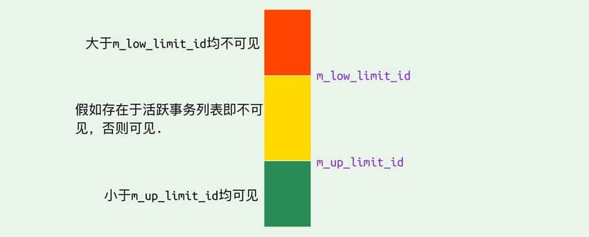

## 1.MVCC

MVCC就是多版本并发控制，一般用于数据库中，比如MySQL。现在的数据库往往需要进行大量的并发操作，传统往往是通过加锁的方式实现的，但是这样可能会造成死锁或者阻塞的情况。而MVCC可以做到不上锁进行读取数据，保证多事务并发操作的的一致性和隔离性。

MVCC使用快照的方式进行读写操作。

### 1.1 读

MVCC读的时候，会使用快照进行读取，即选择一个事务开始时间之前最新的快照，通过这个快照进行读取，此时其他事务可以进行写操作。

### 1.2 写

MVCC在写的时候，会创建一个快照，并且把数据的修改放到快照中，然后再更新到数据库

### 1.3 事务的提交和回滚

事务提交的时候，它的修改会同步到数据库当中

事务回滚的时候，它的修改会被删除

### 1.4 快照清除

在一段时间过后，旧的快照会被清除

## 2.一致性非锁定读和锁定读

### 2.1 一致性非锁定读

一致性非锁定读就是读的时候不必等待当前数据行上的锁释放，可直接读取。一致性非锁定读的实现方式一般是多版本控制，比如MVCC。

一致性非锁定读就是**快照读**。

> RR隔离级别：Repeatable Read，可重复读
>
> RC隔离级别：Read Commited，读已提交

即使一个数据加了X锁，一致性非锁定读都可以进行读取，因为使用的是快照读

在RC和RR隔离级别，普通的select都是用一致性非锁定读，**在RR隔离级别，还可以实现可重复度和防止部分幻读**

- 这个部分幻读是哪一部分？在两次查询之间，如果有一个事务进行插入，RR隔离级别的MVCC就不会产生幻读，因为RR隔离模式下，MVCC只会在第一次查询创建ReadView，所以不会幻读
- RC隔离级别不可以防止幻读，就是因为RC隔离级别下ReadView在每次select时都会生成一次

### 2.2 锁定读

锁定读就是在读取数据行的时候需要加锁

比如：

select ... lock in share mode	会对数据加S锁

select ... for update		insert 	update 	delete会对数据加X锁

- 对于加S锁的数据，其他事务也可以加S锁，但是不能加X锁

- 加X锁的数据，任何锁都不能加

在2.1节中我们说，RR隔离级别的MVCC可以防止部分幻读，但是锁定读因为是当前读，所以可能会有幻读问题，解决办法是对读的数据加一个Next key lock，防止两次查询之间插入。

### 2.3 总结：InnoDB如何解决幻读问题？

InnoDB在RR隔离模式下，使用MVCC + Next key lock来解决幻读问题

- 使用select读时，会使用MVCC来进行一致性非锁定读，此时不会产生幻读
- 使用select in lock model、select for update、insert、update、delete时，会使用锁定读，给数据加S锁或者X锁，对于select数据，会使用next key lock来防止两次读之间插入数据

综上来防止幻读问题

## 3.InnoDB对MVCC的实现

InnoDB中使用以下内容来实现MVCC：

- 隐藏字段
- ReadView
- undo log

### 3.1 隐藏字段

InnoDB会对每个数据行增加三个隐藏字段：

- 行号
- 事务号：用来记录最后对该行进行操作的是哪个事务
- 回滚id：用于数据回滚和MVCC找到上一个更新

### 3.2 ReadView

ReadView**用来做可见性判断的**。

它其中保存着

- 创建这个ReadView的事务id
- 这个ReadView可见的事务id上限
- 这个ReadView不可见的事务id下限

等信息

### 3.3 undo log

undo log用来对数据进行回滚和MVCC找到上一个修改的内容

### 3.4 数据可见性

上面我们介绍ReadView中存放了对当前事务来说可见事务的上限和不可见事务的下限

- 对于可见事务的上限之下的事务，对该事务来说都是可见的
- 对于不可见事务的下限之上的事务，对于该事务都是不可见的
- 对于两者之间的事务，要考虑这个事务是否活跃，如果活跃则不可见，不活跃就是可见的

