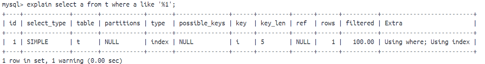
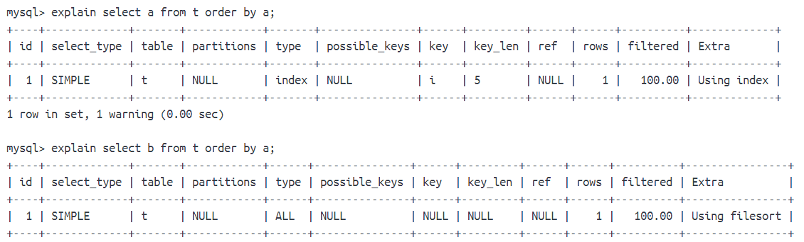

总结于[https://juejin.cn/post/7161964571853815822](https://juejin.cn/post/7161964571853815822)

## 1.最左前缀匹配

## 2.select *

可以使用索引，除非where范围过大，但是不推荐使用select *，因为

- 查找出来的字段可能没用，浪费网络资源
- 数据库变化而resultMap变化就会导致报错

## 3. 函数

函数本身也不会导致索引失效，但是如果改变了查询的值就会了，比如：

select a where length(a)=4

失效的原因是length(a)不是索引中的内容

## 4.计算操作

计算操作也是同理

select a where a + 1 = 4

a + 1也不是索引的内容

## 5. like %

~~左不走右走~~

也不一定，比如只查了有索引的字段，那么查的东西都在索引中，还是可以走的。详见[文章1](https://xiaolincoding.com/mysql/index/index_issue.html#%E9%A2%98%E7%9B%AE%E4%B8%80)。

如下图，a有索引。

## 6. in和not in

这个不一定，如果in或者not in中数据大于30%，就不走索引了

## 7. order by

~~order by 为了减少回表时间，直接走的全表扫描~~

建议不要说这个了，如果某个字段a有索引，这样查询

`select a from t order by a`是会走索引的，底部索引都排好了，肯定要走呀

而

`select b from t order by a`就不必要走了

## 8.or

只有or左右都有索引才会走索引
