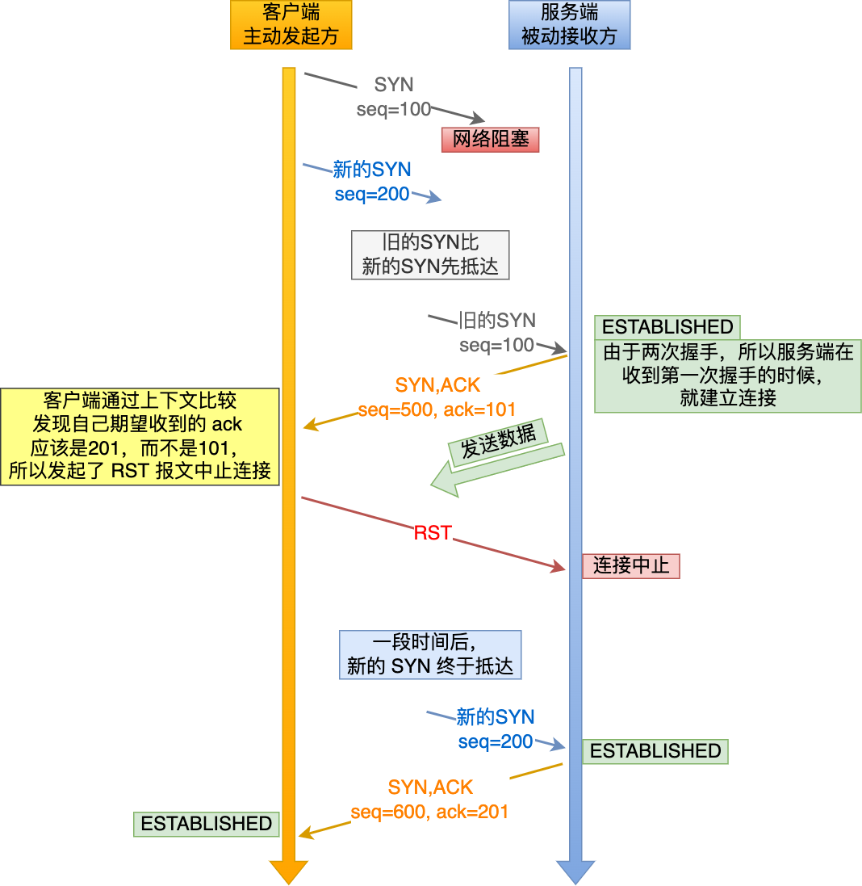
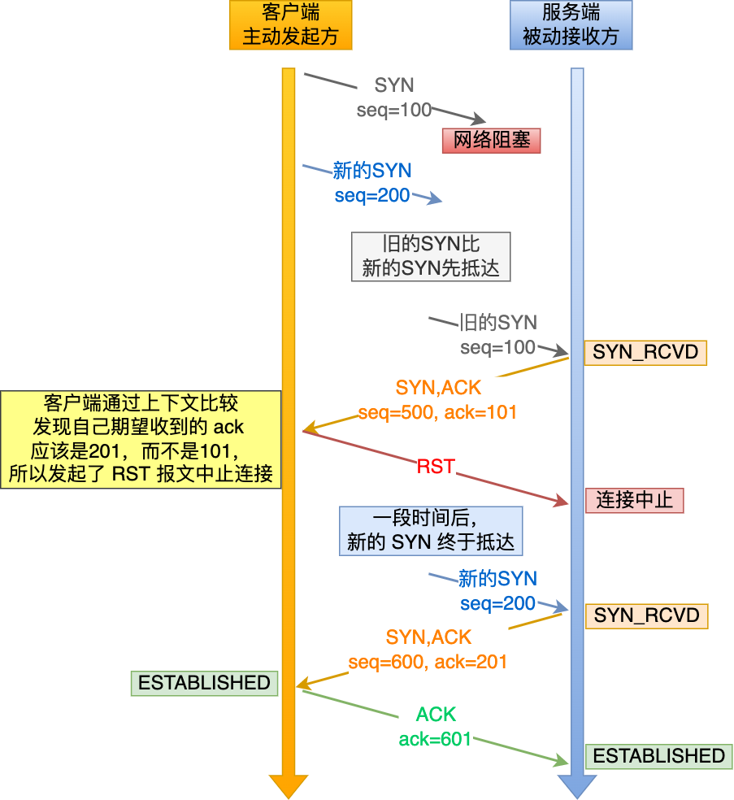

## 0.TCP是哪一层的协议？

传输层

## 1.三次握手

### 1.1 TCP的首部包中包括什么？

TCP的首部包中包括：

- 源端口号 16bit
- 目的端口号 16bit
- 序列号 seq 32bit
- 应答号 ack 32bit
- 标志位 SYN ACK等

### 1.2 TCP三次握手过程

- 第一次握手：客户端将SYN标志位设为1，同时随机生成一个序列号seq=i，此时客户端进入到SYN_SEND状态
- 第二次握手：服务端接收到客户端的消息后，会将SYN标志位设为1，**ACK标志位为1**，同时随机生成一个序列号seq=j，并且把应答号ack设为i+1，此时服务端进到SYN_RECV状态
- 第三次握手：客户端收到服务端消息，验证了ack确实为i+1，此时客户端进入到**ESTABLISHED**状态，并且会发送一个**ACK标志位为1**，ack=j+1报文，服务端收到后，也会进入**ESTABLISHED**状态

### 1.3 为什么要进行三次握手，而不是两次或者四次

这个我们可以通过三次握手分别能确认什么状态来考虑

- 第一次握手，客户端告诉服务端要连接，服务端接收到消息后，可以确认客户端到服务端通信是正常的
- 第二次握手，服务端告诉客户端收到消息了，客户端验证了收到的ack确实是i+1，客户端可以确认自己发送是正常的，接收是正常的，此时，服务端还无法确认自己的发送是正常的，所以需要第三次握手
- 第三次握手，客户端告诉自己收到了服务端的消息，并且ack是j+1，此时服务端也可以确认自己的发送是正常的。到此，客户端和服务端都已经确认自己发送和接收都是正常的了

> 回答上面的，即tcp三次握手才能确认双方状态也可以，但是不是三次握手的主要原因

#### 三次握手的主要原因

以下内容来自[文章1](https://blog.csdn.net/qq_34827674/article/details/122040501) [文章2](https://www.zhihu.com/question/429915921)

三次握手的原因有以下三点：

- 避免历史连接
- 同步双方初始序列号
- 减少资源浪费

⭐避免历史连接

如果只有两次握手，可以考虑这样一个过程：

- 客户端发送第一次握手，序列号seq为i
- 发送完成后，客户端异常重启了，重启后，又进行了第一次握手，序列号为j
- 某个时间后，服务端接到了第一次握手内容，并且因为只有两次握手，所以服务端会在此刻就建立连接并且发送数据
- 客户端收到服务端的第二次握手内容，发现ack不是j+1而是i+1，就发送了中止消息，服务端此刻断开连接
- 服务端再次收到了第一次握手的消息，seq为j，此刻会再次建立连接

两次握手：图源文章1中

三次握手：图源文章1中

在这个过程中，可以发现有一个消息是在历史连接上发送的，这个消息是没有必要发送的。如果要避免在历史连接上发送消息，就需要三次握手

⭐同步双方序列号

三次握手可以同步并且确认对方收到了正确的序列号，序列号会用在后面收发数据过程中保证数据包顺序、去重等。

两次握手的话，服务端是没有办法确认自己发送的序列号是否正常被客户端接收到

⭐那么四次握手可不可以呢？

可以，但没必要，一般来说，四次握手指的是第二次握手只发送ack，第三次握手发送seq，实际上是没必要的，可以合并为一次握手

⭐减少资源浪费

两次握手的话，客户端发送一个握手请求，服务端就会建立连接一次，然后发送消息，这个过程是浪费掉的，完全没有必要

## 2.四次挥手

### 2.1 四次挥手过程

TCP的挥手既可以是客户端发起的，也可以是服务端发起的，以客户端发起的为例：

- 第一次挥手：客户端发送挥手报文，报文FIN标志位设置为i
- 第二次挥手：服务端收到客户端挥手报文，会将ack设置为i+1，至此，可以表示客户端到服务端已经不再进行通信了
- 第三次挥手：服务端发送挥手报文，报文FIN标志位设置为j
- 第四次挥手：客户端收到服务端报文，将ACK标志位设置为1，将ack设置为j+1，至此，服务端到客户端也已经不再进行通信了

### 2.2 为什么要进行四次挥手，而不是三次挥手

我们可以考虑第三次挥手之后，客户端不再进行第四次挥手会发生什么。

如果只有三次挥手，服务端发送完之后就会断开了，而这个报文可能在传输过程中丢失了，客户端一直都没有收到这条报文，不知道服务端那边要断开了，就会一直处于连接状态

而如果有了第四次挥手，客户端收到服务端的第三次挥手时候，会发送一个报文，如果两倍的最长报文等待时间之后服务端还没有收到第四次挥手，那么可以认为这条报文在传输过程中丢失了，就会重发这个报文，直到接收到为止。
