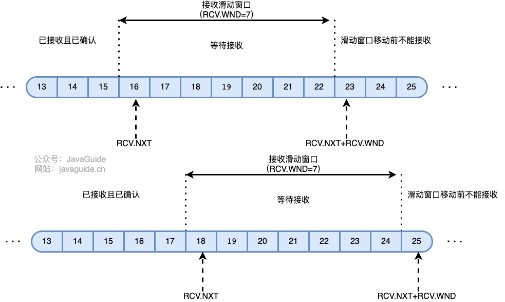
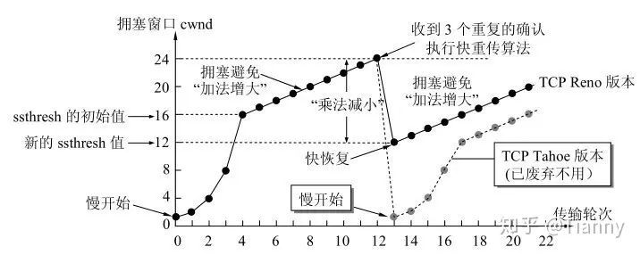

## 1. TCP

TCP（Transmission Control Protocol）传输控制协议，是位于传输层的协议

**TCP是面向连接的、可靠的、面向字节流的传输层通信协议**

- 面向连接的：TCP需要经过三次握手建立连接、四次挥手断开连接

### 1.1 TCP是如何保证可靠性

总结于[文章1](https://zhuanlan.zhihu.com/p/112317245) [文章2](https://javaguide.cn/cs-basics/network/tcp-reliability-guarantee.html) [文章3](https://zhuanlan.zhihu.com/p/261096328)

- 数据分块：TCP会将数据分为多个数据块，我们称之为报文段
- 对数据包进行排序和去重：每个数据包都有一个序列号，接收端可以根据序列号进行排序和去重
- **校验和**：TCP会将首部和数据进行校验，这样在发送过程中出现任何变化，接收端都会发现并且会丢掉这个数据包，不对发送端进行ACK确认，这样发送端就知道这个数据包丢失了，就会重新发送这个数据包
- 重传机制：所谓重传机制就是发送端如果一段时间（应该是2倍的报文段最长寿命MSL？）内没有接收到ACK确认信号，就会重发这个数据包
- 流量控制：TCP发送端和接收端都有一个缓冲空间，一旦接收端需要处理的数据量大于缓冲空间大小了，那么就有可能发生数据包丢失，所以此时接收端发送的**确认信号中的窗口字段减小一些**，发送端就知道要慢一点发了。**TCP使用滑动窗口来进行流量控制**。
- 拥塞控制：TCP发送端会根据网络拥塞程度来控制发送的速度，这个速度由拥塞窗口决定。最终发送数据包的速度是根据滑动窗口和拥塞窗口的最小值来决定的。

### 1.2 TCP如何进行流量控制

TCP使用滑动窗口进行流量控制。发送端维护一个发送窗口，接收端维护一个接收窗口。发送端和接收端都有一个缓冲区，当接收端发现当前接收的数据包数量比缓冲区大了，那么就会通过确认信号ACK中的**窗口字段**告诉发送端慢一点发，发送端就会慢一点发了。

- 对于发送端的数据包队列，有四种状态
  - 已经发送已经确认
  - 已经发送没有确认
  - 即将发送
  - 不准发送
- 对于接收端的数据包队列，有三种状态
  - 已经接收
  - 即将接收
  - 不准接收

***需要注意的是：TCP滑动窗口的单位是字节，而不是报文段！！！***

### 1.3 TCP如何进行拥塞控制

所谓拥塞，就是网络中对某个数据的需求大于供给，这样就会导致网络的拥塞。

TCP发送端使用拥塞窗口来进行拥塞控制

对于TCP拥塞控制来说，有四种算法：

- 慢开始
- 拥塞避免
- 快重传
- 快恢复

#### 1.3.1 慢开始

对于刚开始发送来说，我们并不知道网络拥塞情况，不能贸然发送过多的内容。

对于慢开始，拥塞窗口大小从1开始，每次加倍

#### 1.3.2 拥塞避免

当拥塞窗口大小达到了ssthresh（慢开始门限），就会采用拥塞避免，每一个RTT（报文往返时间），就会给拥塞窗口大小+1

#### 1.3.3 快重传

快重传就是接收端在接收到数据包后，不是等待自己发送数据时才捎带着确认信号，而是立刻发送确认信号，无论自己是否接收到了无序数据包。发送端接收到三个重复的确认信号，立刻快重传这个丢失的数据包。

#### 1.3.4 快恢复

快恢复就是发送端发现自己发送的个别数据包丢失，会将慢开始门限(ssthresh)降低为现在拥塞窗口大小的一般，并且把拥塞窗口大小也设置为该值，然后进行拥塞避免，而不是从1开始。

### 1.4 ARQ协议

自动重传请求（Automatic Repeat-reQuest，ARQ），是传输层和数据链路层为了在不可靠的网络中实现可靠传输的协议。它包括确认和重传两块内容。

自动重传请求有两种：停止等待ARQ和连续ARQ

#### 1.4.1 停止等待ARQ

停止等待ARQ就是发送一个数据包之后就停止发送，等待确认信号，只有收到确认信号之后才会发送下一个

停止等待ARQ的问题就是网络利用率低。

对于确认信号，不正常状态可能有两种：

- 确认丢失：确认丢失就是接收端发送的确认信号丢失了，发送端没有收到，一段时间之后，发送端就是继续发送这个数据包，此时接收端收到了重复的数据包，它会做两件事情：丢掉这个数据包，并且仍然对这个数据包进行确认
- 确认迟到：确认迟到是指发送端迟迟没有接到这个确认信号，于是继续发送这个数据包，但是过一会又接到了，此时发送端会忽略重复的确认信号，接收端也会忽略重复的数据包

#### 1.4.2 连续ARQ

为了提高网络利用率，发送端可以同时发送多个数据包，而接收端只对这一批次的最后一个数据包进行确认，表示这一批都接收到了。

这样也会有一个问题，就是如果一批中某个数据包丢失了，发送端需要发送这一个数据包之后的所有数据包，浪费比较大。

### 1.5 超时重传如何实现？超时时间怎么制定

超时重传通过确认信号来实现，接收端在接收到数据包后，会发送确认信号，如果发送端在超时时间之内没有接收到确认信号，就会进行重传

超时时间一般根据往返时间RTT来决定
