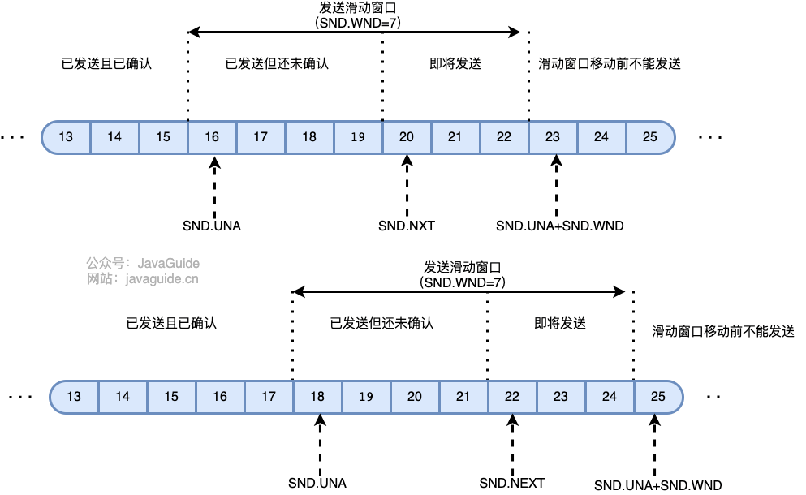
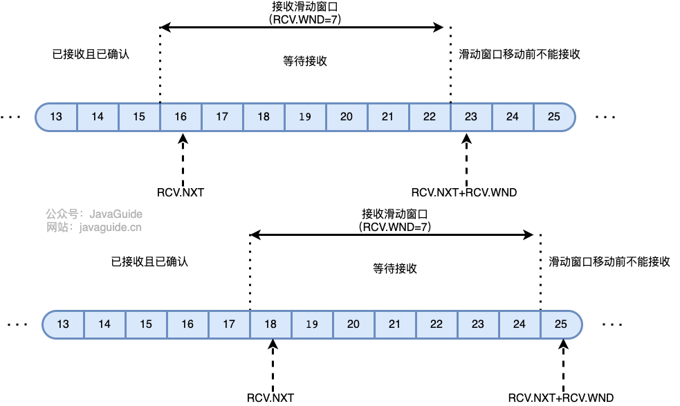
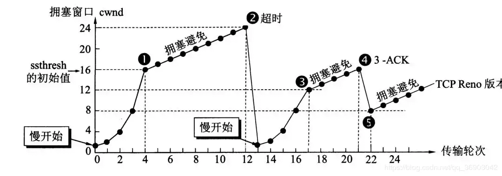

## 1. TCP

TCP（Transmission Control Protocol）传输控制协议，是位于传输层的协议

**TCP是面向连接的、可靠的、面向字节流的传输层通信协议**

- 面向连接的：TCP需要经过三次握手建立连接、四次挥手断开连接
- 可靠的：

### 1.1 TCP是如何保证可靠性

总结于[文章1](https://zhuanlan.zhihu.com/p/112317245) [文章2](https://javaguide.cn/cs-basics/network/tcp-reliability-guarantee.html)

- 数据分块：TCP会将数据分为多个数据块，我们称之为报文段
- 对数据包进行排序和去重：每个数据包都有一个序列号，接收端可以根据序列号进行排序和去重
- **校验和**：TCP会将首部和数据进行校验，这样在发送过程中出现任何变化，接收端都会发现并且会丢掉这个数据包，不对发送端进行ACK确认，这样发送端就知道这个数据包丢失了，就会重新发送这个数据包
- 重传机制：所谓重传机制就是发送端如果一段时间（应该是2倍的报文段最长寿命MSL？）内没有接收到ACK确认信号，就会重发这个数据包
- 流量控制：TCP发送端和接收端都有一个缓冲空间，一旦接收端需要处理的数据量大于缓冲空间大小了，那么就有可能发生数据包丢失，所以此时接收端发送的**确认信号中的窗口字段减小一些**，发送端就知道要慢一点发了。**TCP使用滑动窗口来进行流量控制**。
- 拥塞控制：TCP发送端会根据网络拥塞程度来控制发送的速度，这个速度由拥塞窗口决定。最终发送数据包的速度是根据滑动窗口和拥塞窗口的最小值来决定的。

### 1.2 TCP如何进行流量控制

TCP使用滑动窗口进行流量控制。发送端维护一个发送窗口，接收端维护一个接收窗口。发送端和接收端都有一个缓冲区，当接收端发现当前接收的数据包数量比缓冲区大了，那么就会通过确认信号ACK中的**窗口字段**告诉发送端慢一点发，发送端就会慢一点发了。

- 对于发送端的数据包队列，有四种状态
  - 已经发送已经确认
  - 已经发送没有确认
  - 即将发送
  - 不准发送
- 对于接收端的数据包队列，有三种状态
  - 已经接收
  - 即将接收
  - 不准接收

### 1.3 TCP如何进行拥塞控制

所谓拥塞，就是网络中对某个数据的需求大于供给，这样就会导致网络的拥塞。

TCP发送端使用拥塞窗口来进行拥塞控制

对于TCP拥塞控制来说，有四种算法：

- 慢开始
- 拥塞避免
- 快重传
- 快恢复

#### 1.3.1 慢开始

对于刚开始发送来说，我们并不知道网络拥塞情况，不能贸然发送过多的内容。

对于慢开始，拥塞窗口大小从1开始，每次加倍

#### 1.3.2 拥塞避免

当拥塞窗口大小达到了ssthresh，就会采用拥塞避免，每一个RTT（报文往返时间），就会给拥塞窗口大小+1

#### 1.3.3 快重传和快恢复

如果没有快重传和快恢复，那么TCP遇到发送数据包丢失情况下，会暂停发送，这比较耗时。而快重传和快恢复，就是接收端一旦接收到没有按照顺序到来的数据包，就会重发ACK，发送端接收到3个重发ACK，就会重发这个数据包，这个过程不会暂停。

快重传和快恢复对于单个数据包丢失非常友好，但是同时有多个数据包丢失，则不能很好解决。

