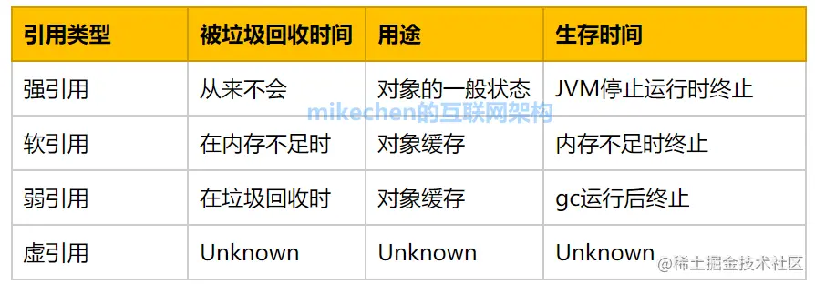
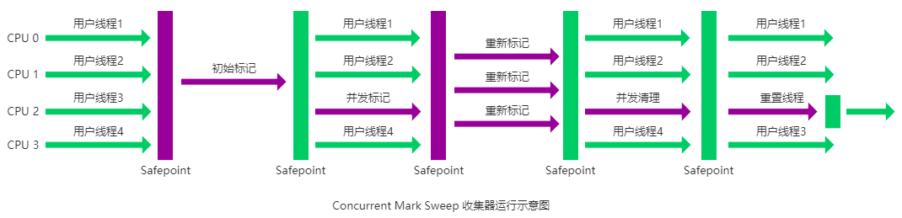
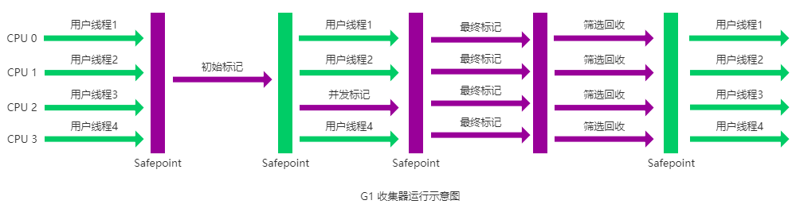

JVM的垃圾回收，主要针对的就是对堆内存的回收

## 1.堆内存结构

对于JVM堆来说，主要分为以下部分：

- 新生代，其中新生代中包括伊甸园和两个存活区
- 老年代
- 元空间（JDK8之后方法区的实现方式）

## 2.内存分配和回收原则

### 2.1 分配原则

#### 新的对象优先分配到新生代的伊甸园

当伊甸园区不够之后，会考虑进行一次垃圾回收 **(Minor GC)** ，给伊甸园腾出一些空间，之前处于伊甸园区的对象会被移动到存活区，**如果存活区空间不够，那么只好通过空间分配担保，把对象提前放到老年代**。

#### 大内存对象会被分配到老年代

对于大内存对象，会直接分配到老年代

#### 长期存活的对象将会进入老年代

一个对象出生在伊甸园，年龄为0，在经历过一次垃圾回收并且活下来，则会进入存活区，年龄为1，此后，每熬过一次垃圾回收，年龄都会增加一岁，直到到达了某个年龄，这个对象会进入老年代。

### GC分类

- Minor/Young GC，只进行新时代回收
- Old GC，只进行老年代回收
- Full/Major GC，对堆中的所有位置都进行回收
- Mixed GC，只对新时代和部分老年代进行回收

### 空间分配担保

**空间分配担保，就是在进行Minor GC之前，JVM会进行老年代空间大小确认，只有满足了以下条件，才会进行Minor GC，否则进行Full GC**：

- 老年代剩余的连续空间大于新生代目前对象所占空间或者历次平均占用空间

## 2. 死亡对象的判断方法

有两种常见的死亡对象判断方法：引用计数器和可达性分析

### 2.1 引用计数器

引用计数器的想法比较简单：

- 如果一个对象被引用了，那么引用次数加1
- 如果一个对象被引用结束了，引用次数减1
- 如果一个对象引用次数为0，那么该对象可以被垃圾回收了

但是引用计数器有个问题，就是没用办法解决循环引用，如果两个对象相互引用，即使它们和外界没用任何联系了，它们的引用次数也都不是0，也就没有办法被回收

### 2.2 可达性分析

可达性分析，就是从一系列被称之为"GC Roots"的对象开始，去寻找被它引用的对象链。如果一个对象最终没有被GC Roots引用到，那么就代表可以进行回收了。

#### 哪些对象可以作为GC Roots

- 虚拟机栈中引用的对象
- 本地方法栈中引用的对象
- 方法区中的静态变量引用的对象
- 方法区中常量池中的变量引用的对象
- **所有被同步锁持有的对象**

#### 不可达的对象一定会被垃圾回收吗

不一定，一个对象被垃圾回收，至少要经过两次 ~~可达性分析~~ 标记过程。第一次判断不可达后，**还要进行一次筛选，判断该对象是否有必要执行finalize方法，如果一个对象已经执行过一次finalize方法或者没有覆盖finalize方法，那就不会被垃圾回收。**

如果一个对象被判断确实有必要执行finalize方法，那么会将它放到一个队列当中去，但是也不是非死不可，在队列中只要这个对象和任何一个引用链搭上关系，它就会被移除队列，继续活下去。

### 2.3 如何判断一个常量可以被回收

当一个常量没有任何引用指向它，那么便可以进行回收

### 2.4 如何判断一个类可以进行回收

注意！这里说的是类，不是上面提到的对象的回收

一个类要进行回收，需要满足三大条件：

- 它的所有实例对象都已经被回收，堆中没有任何该类的实例
- 它的类加载器ClassLoader已经被回收
- 它的Class对象的引用都已经被回收，不会有反射可以反射到这个类

满足这三大条件，这个类就可以被回收，但是不像对象那样，说回收就回收，类到这里也不会一定回收

## 3.引用类型总结

总结于[文章1](https://juejin.cn/post/7131175540874018830)

Java中有四大引用：强引用、软引用、弱引用和虚引用，它们的强度依次下降

### 3.1 强引用

强引用是我们最常见的引用，我们直接new出来的引用都是强引用。

强引用不会被垃圾回收，即使内存不足，宁可抛出OOM也不会进行内存回收

### 3.2 软引用

软引用比强引用弱一些，它只会在内存不足的时候才会被回收。它使用SoftReference类来声明。

软引用的垃圾不足才回收的特点，可以用来做高速缓存。比如MyBatis中的SoftCache：

```java
public Object getObject(Object key) {
    Object result = null;
    SoftReference<Object> softReference = (SoftReference)this.delegate.getObject(key);
    if (softReference != null) {
        result = softReference.get();
        if (result == null) {
            this.delegate.removeObject(key);
        } else {
            synchronized(this.hardLinksToAvoidGarbageCollection) {
                this.hardLinksToAvoidGarbageCollection.addFirst(result);
                if (this.hardLinksToAvoidGarbageCollection.size() > this.numberOfHardLinks) {
                    this.hardLinksToAvoidGarbageCollection.removeLast();
                }
            }
        }
    }
    return result;}
```

在测试引用的时候，注意不要用 `String s = "a"` 而是要用 `String s = new String("a")`。

### 3.3 弱引用

弱引用比软引用还低一些，对于弱引用，进行垃圾回收的时候，无论内存够不够，只要弱引用所在区域进行垃圾回收了，就会将它回收掉。弱引用使用WeakReference进行创建。

#### 弱引用的应用

弱引用的应用包括WeakHashMap，我们在使用HashMap的时候，键是强引用的，进行垃圾回收不会把它回收掉，而WeakHashMap的键是弱引用的，遇到垃圾回收就会回收掉，适合做一些缓存表

WeakHashMap测试：

```java
package d240323;

import java.util.HashMap;
import java.util.WeakHashMap;

/**
 * @author KindBrave
 * @since 2024/3/23
 */
public class Main {
    public static void main(String[] args) throws InterruptedException {
        HashMap<String, String> map = new HashMap<>();
        WeakHashMap<String, String> weakHashMap = new WeakHashMap<>();
        map.put(new String("key"), "a");
        weakHashMap.put(new String("key"), "b");
        System.out.println(map);            //{key=a}
        System.out.println(weakHashMap);    //{key=b}
        System.gc();
        System.out.println(map);            //{key=a}
        System.out.println(weakHashMap);    //{}
    }
}

```

### 3.4 虚引用

虚引用是最弱的一种引用，它不和生命周期相关联，随时可能被回收。它必须和ReferenceQueue来做配合，主要用于判断一个对象什么时候被回收，在回收之前会将这个虚引用放到队列中，方便做一些回收前的操作。



## 4.垃圾收集算法

垃圾收集算法整体来说有四种：标记-清除，标记-复制，标记-整理，分代收集

### 4.1 标记-清除

标记-清除是最基本的垃圾收集算法，它的思想就是对没有引用的对象进行标记，然后清除

这样清除可能导致的最大问题就是内存碎片，因为被清除的内存位置都是不连续的

其次，标记和清除两个过程耗时都比较大

### 4.2 标记-复制

为了解决内存碎片问题，有了标记-复制算法，标记-复制算法就是把内存分为两块区域，每次使用只使用一块，回收之前，会对没有引用的对象进行标记，回收时，会把仍然需要存活的对象复制到另一块内存区域，这一块整体清除。

标记-复制的最大问题就是可用内存减半了

### 4.3 标记-整理

标记-整理不会像标记-复制那样，可用内存减半，而是把仍然需要存活的对象给整理到一块，然后把后面的内存都释放掉，这样，仍然存活的对象都是连续的，后面也会空出大量的连续空间

### 4.4 分代收集

其实上面的三种垃圾收集策略各有各的特点，也各有各的缺点，所以根据不同代的特点来选择不同策略是比较好的。比如：

- 新生代经常有大量对象死亡，所以选择标记-复制
- 老年代一般对象数量多、占用内存大，而且没有内存分配担保，所以选择标记-整理或者标记-清除

**这也是为什么JVM堆要进行分代的原因**

## 5.垃圾收集器

JVM中垃圾收集器数量众多。

- Serial
- ParNew
- Parallel Scavenge
- CMS
- G1
- ZGC

### 5.1 Serial 串行

Serial是JVM第一个垃圾收集器，它是串行单线程的，也就是说，在垃圾回收的时候必须暂停工作线程。

Serial使用了分代收集，

- 对于新生代，Serial使用了标记-复制
- 对于老年代，Serial使用了**标记-整理**

### 5.2 ParNew 

ParNew和Serial类似，就是Serial的多线程版本

**它是Server虚拟机的首选，因为除了Serial，只有ParNew可以和CMS配合。**

### 5.3 Parallel Scavenge

Parallel Scavenge是一个重视CPU效率的回收器，**更加关注吞吐量**，它同样采用了分代回收：

- 新生代标记-复制
- 老年代标记-整理

### 5.4 CMS **Concurrent Mark Sweep**

CMS更加关注于用户的体验，也就是尽可能让回收快速进行或者和工作线程并行执行

**CMS没有使用分代回收，而是统一使用标记-清除**

它的执行过程如下：

- 初始标记：**首先暂停工作线程，标记直接和GC Roots相连接的对象，这个速度很快**
- 并发标记：**工作线程恢复，同时进行可达性分析，但是因为工作线程执行过程对象的引用可能会发生变化，所以这个步骤就是记录哪些引用发生了变化**
- 重新标记：**暂停工作线程，对上个步骤中发生变化的内容进行重新标记**
- 回收：**工作线程恢复，同时进行垃圾回收**

缺点：

- 对于回收过程中产生的引用变化无法回收
- 标记-清除会产生大量内存碎片



### 5.5 G1

G1收集器在尽可能较短时间完成回收的基础上，还注重了高吞吐量。

G1的特点

- 并发
- 分代
- 策略，G1整体上看是标记-整理，部分上看是标记-复制
- 可预测的停顿

G1的流程

- 初始标记
- 并发标记
- 最终标记

    （以上三个和CMS类似）

- 回收，G1的回收不像CMS一样是并发的，而是暂停工作线程的。



### 5.6 ZGC

比较新

暂停时间在几毫秒内，并且不受堆大小影响，但是会牺牲一些吞吐量
