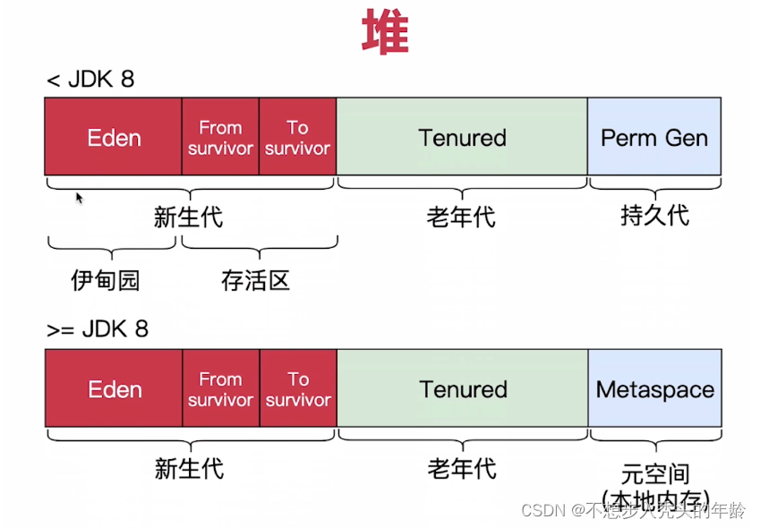
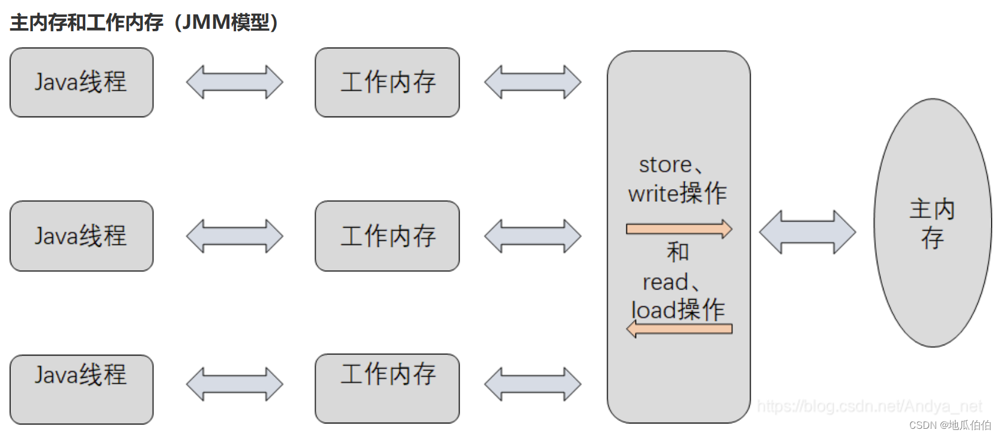

参考[参考1](https://zhuanlan.zhihu.com/p/38348646) [参考2](https://cloud.tencent.com/developer/article/2398564)

## 1.JVM内存结构（也叫JVM内存模型）

JVM内存结构包括

- 堆
- 方法区
- 虚拟机栈
- 本地方法栈
- 程序计数器

### 1.1 堆

堆是线程共享的，是引用类型的存放位置，也是垃圾回收的主要区域

堆中可以分为新生代和老年代

### 1.2 方法区

方法区也是线程共享的，它会存放一些类的静态变量和类的信息（即类模型对象）

### 1.3 虚拟机栈

虚拟机栈是线程私有的，虚拟机栈是存放方法执行中的基本类型和引用类型的引用的位置

### 1.4 本地方法栈

本地方法栈也是线程私有的，是Java调用native原生方法执行C/C++方法的位置

### 1.5 程序计数器

程序计数器也是线程私有的，它记录了虚拟机执行到了哪行字节码

## 2.Java内存模型JMM

Java内存模型是给Java多线程通信准备的，整体上围绕了

- 可见性
- 有序性
- 原子性

三大特性展开

### 2.1 可见性

所谓可见性，就是一个线程对某个变量进行操作，其他线程是可以看见的。我们可以使用volatile关键字或者synchronized代码段来保证可见性。

### 2.2 有序性

为了优化性能，JVM会进行指令重排，比如写操作可能会放到最后执行。但是对于多线程来说，指令重排可能会导致一些问题，比如一个线程的读在另一个线程的写之后，为了解决这一问题，JVM引入了happens-before原则，保证了多线程操作的有序性

### 2.3 原子性

原子性是指某一个操作是原子的，不会被其他线程打断。Java中使用volatile关键字标记的变量读写就不会被其他线程打断。

### 2.4 工作内存和主内存

主内存是线程共有的，其中保存着一些变量。

工作内存是线程私有的，是JVM虚拟出来的一块内存，它之中保存着主内存中变量的副本。

一个线程对主内存的变量进行写入，先通过工作内存，然后再写入主内存。然后，另一个线程会从主内存中读取这个变量到自己的工作内存中，从而得知变化。

