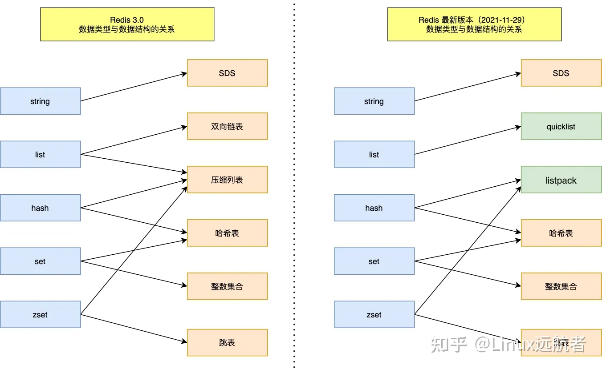
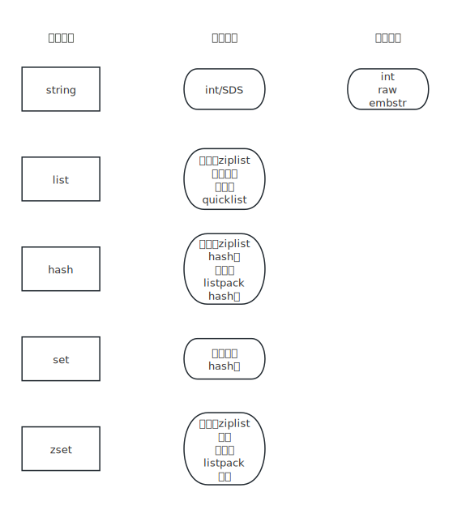
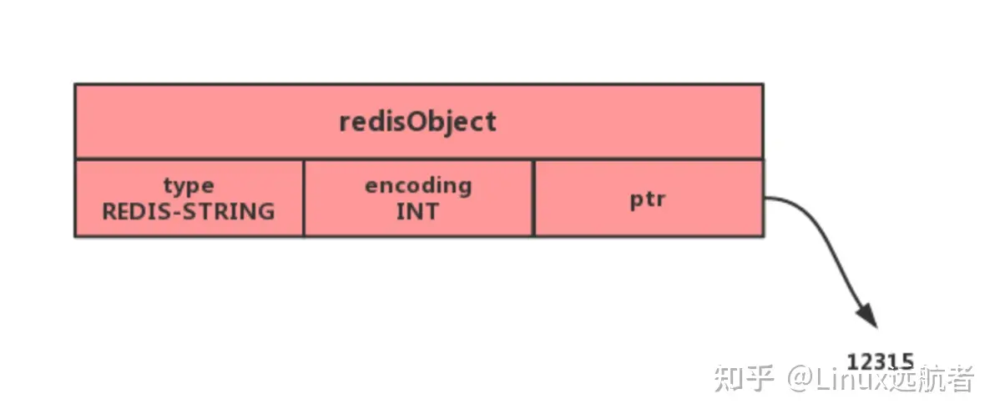
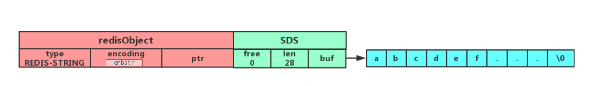
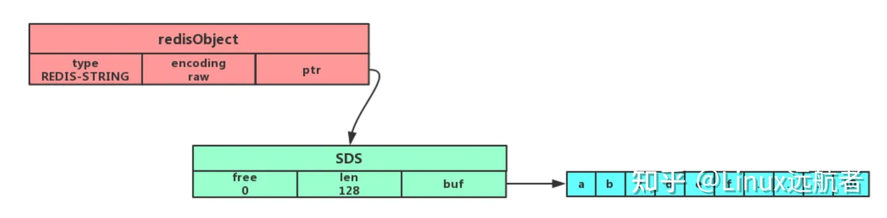
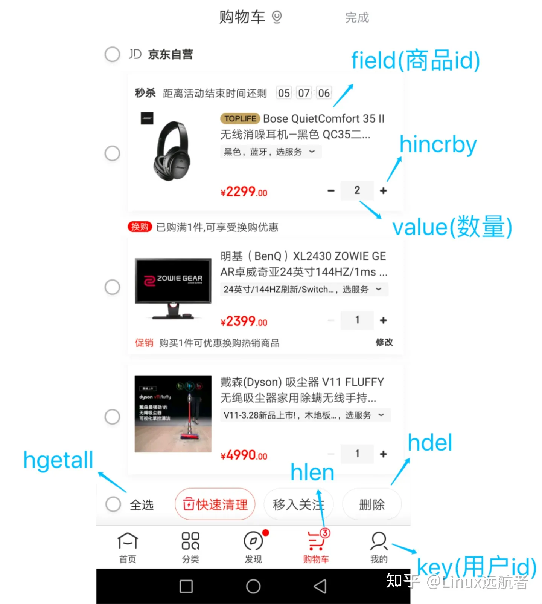
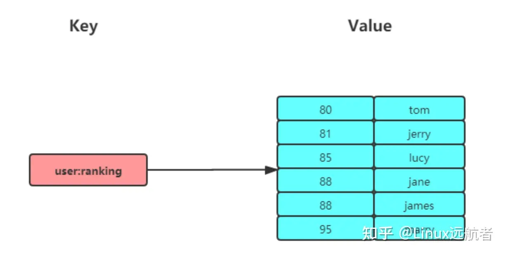

总结于[来源1](https://blog.csdn.net/weixin_43246215/article/details/108041739) [来源2](https://zhuanlan.zhihu.com/p/631670359)

Redis中有5中基本类型和4种常见类型（后续更新支持的），它们是：

## 五种基本类型：

- string
- list
- set
- sorted set
- hash

## 四种常见类型：

- GEO 地理位置 v3.2支持
- HyperLogLog v2.8支持
- Bitmap 位图 v2.2支持
- Stream v5.0支持





## 1.string

string是最基本的key-value结构，key是唯一表示，value不只是字符串，也可以是数字，value最长可容纳的数据长度是512M。

### 1.1 内部实现

#### 1.1.1 数据结构

**string底层的数据结构主要是int和SDS（简单动态字符串）。**

下面之所以和C语言来比，是因为Redis的底层实现是C。

SDS和C标准字符串不太一样，SDS相比C标准字符串，支持：

- **SDS不仅可以保存文本数据，还可以保存二进制数据。** 原因：SDS使用一个参数len来保存字符串长度，而不是通过终止符('\\0')来判断字符串是否结束。而且，SDS中的所有API都会以处理二进制的方式来处理存储在buf[]数组中的数据。所以，SDS不仅可以存储文本，还可以存储图片、音频、视频、压缩包等二进制数据。
- **SDS中获取字符串长度的时间复杂度为O(1)。** 原因：因为SDS使用参数len来保存字符串长度，C字符串通过遍历的方式来获取字符串长度，所以时间复杂度为O(n)。
- **SDS的API是安全的**。SDS中拼接字符串不会导致缓冲区的溢出，因为SDS会在拼接之前检查空间是否满足要求，如果不满足就会进行扩容。

#### 1.1.2 数据编码

**string内部编码有int、raw、embstr，其中int对应数据结构int，raw和embstr对应数据结构SDS。**

- 如果一个字符串对象保存的是整数值，并且这个值可以用long来表示，那么字符串对象会将整数值保存在字符串对象结构的ptr属性里，并将字符串对象的编码设置为int。

  
- 如果一个字符串对象保存的是一个字符串，且字符串长度小于等于某个字节（v2.x是32字节），那么字符串对象会使用SDS来保存这个字符串），并且将对象编码设置为embstr，embstr是专门用于存储短字符串的一种优化编码。

  
- 如果一个字符串对象保存的是一个字符串，且字符串长度大于某个字节，那么字符串对象仍然使用SDS数据结构来保存这个字符串，但是对象编码是raw。此时可以看的ptr是指向SDS的地址的

  

##### 那么，embstr和raw有什么区别？

embstr会通过一次内存分配函数来分配一块连续的内存空间来保存redisObject和SDS，而raw会通过两次内存分配来分别分配两块内存空间来保存redisObject和SDS。这样做的好处：

- embstr将创建字符串对象所需的内存分配次数从两次降低到了一次
- 释放embstr编码的字符串同样也只需要调用一次内存释放函数
- 因为embstr编码的字符串对象的所有数据都保存在一块连续的内存里面，可以更好地利用CPU缓存提升性能

当然，这样做也有缺点：

- 如果字符串长度增加需要重新分配内存，redisObject和SDS都需要重新分配，所以，embstr编码的字符串实际上是只读的，Redis没有为embstr编码的字符串对象提供相应的修改程序。当我们对embstr编码的字符串进行append操作的时候，Redis会将embstr编码转换成raw编码，然后再进行修改。

### 1.2 应用场景

- 缓存对象
- 计数
- 分布式锁
  Redis可以实现分布式锁，因为SET命令有个参数NX，可以实现“只有不存在才插入”，这样就可以以插入成功作为加锁成功，插入失败作为加锁失败。同时，SET命令还有一个参数PX，表示这个key多久(ms)后会过期（删掉这个key），可以防止上锁后忘记解锁。
- 共享Session
  在单服务器中，Session可以存到服务器上，但是分布式部署的就不行了，因为下一次分配到的服务器可能不是上一次的，就没有Session信息了，所以可以把Session存到Redis中。

## 2.list

list是字符串列表，按插入顺序进行排序，可以进行头插和尾插，列表最大长度位2^32-1。

### 2.1 内部实现-数据结构

在v3.2之前，list底层数据结构为双向链表或压缩列表

- 如果列表长度小于512（默认），列表中数据长度均小于64字节（默认），那么就使用压缩列表。
- 否则，使用双向链表。

v3.2之后，就只有quicklist了。有关quicklist，可以参考[这篇文章](https://www.cnblogs.com/hunternet/p/12624691.html)。

### 2.2 常用命令

```bash
lpush key value
lpop key
rpush key value
rpop key
# 返回指定区间内的元素
lrange key start stop
# 从key列表表头弹出一个元素，没有就阻塞timeout秒，如果timeout=0则一直阻塞
blpop key [key ...] timeout
# 从key列表表尾弹出一个元素，没有就阻塞timeout秒，如果timeout=0则一直阻塞
brpop key [key ...] timeout
```

### 2.3 应用场景

消息队列是list的常见应用场景。

**消息队列在存取消息时，需要保证三个需求：消息保序、重复消息的处理、保证消息的可靠性。**

#### 2.3.1 list如何保证消息的有序性

list本身就是一个先进先出的数据类型，只需要通过lpush和rpop的组合就可以保证消息的有序性了。

但是这样可能会有一个问题，就是如果list中没有数据，那么消费者就需要一直尝试读取，这样效率比较低，所以Redis提供了一个方法brpop/blpop，可以在list中没有数据时进行阻塞，这样效率会好一些。

#### 2.3.2 list如何处理重复消息

这个还挺抽象的，为什么需要处理重复消息？因为重复的消息代表已经被处理过了，不需要再处理了，所以需要进行判断。

消费者要实现重复消息的判断，需要 2 个方面的要求：

* 每个消息都有一个全局的 ID。
* 消费者要记录已经处理过的消息的 ID。当收到一条消息后，消费者程序就可以对比收到的消息 ID 和记录的已处理过的消息 ID，来判断当前收到的消息有没有经过处理。如果已经处理过，那么，消费者程序就不再进行处理了。

但是**List 并不会为每个消息生成 ID 号，所以我们需要自行为每个消息生成一个全局唯一ID**，生成之后，我们在用 LPUSH 命令把消息插入 List 时，需要在消息中包含这个全局唯一 ID。

例如，我们执行以下命令，就把一条全局 ID 为 111000102、库存量为 99 的消息插入了消息队列：

```text
> LPUSH mq "111000102:stock:99"
(integer) 1
```

#### 2.3.3 如何保证消息的可靠性

所谓的可靠性，就是一个消息执行了，但是失败了，不能就不执行了，还得回到队列中等待执行，list通过brpoplpush把当前读到的数据存到**另一个list中**进行备份，这样就可以在执行失败后读备份list中的数据执行了。

#### 2.3.4 list实现消息队列有什么问题

list不支持多个消费者消费同一条数据，因为一条数据一旦被处理，就从list中消失了，其他消费者读不到了。Redis的Stream类型可以解决这个问题。

## 3.hash

hash是k-v存储的数据格式，它的value是[{key:value},{key,value}...]这种。hash特别适用于存储对象，要比string方便不少。

### 3.1 内部实现

hash类型的底层数据结构是压缩列表或者哈希表

- 如果哈希类型的元素个数小于512个，所有值小于64字节，Redis会使用压缩列表
- 否则，会使用哈希表。

v7.0，压缩列表被弃用，使用listpack数据结构了。

### 3.2 常用命令

```bash
# 存储一个哈希表key的键值
HSET key field value   
# 获取哈希表key对应的field键值
HGET key field

# 在一个哈希表key中存储多个键值对
HMSET key field value [field value...] 
# 批量获取哈希表key中多个field键值
HMGET key field [field ...]   
# 删除哈希表key中的field键值
HDEL key field [field ...]  

# 返回哈希表key中field的数量
HLEN key   
# 返回哈希表key中所有的键值
HGETALL key 

# 为哈希表key中field键的值加上增量n
HINCRBY key field n  
```

### 3.3 应用场景

- 缓存对象
- 购物车，以用户id为key，商品id为field，商品数量为value

  

## 4.set

set是一个**无序且唯一**的键值集合，不会按照插入的先后顺序进行存储。最多可以存储2^32-1个值

set和list的区别

- list可以存储重复数据，set只能存储非重复数据
- list有序，set无序

### 4.1 内部实现

set底层数据结构有两种：哈希表和整数集合

- 如果集合中的元素都是整数且长度小于512，那么底层数据结构就是整数集合
- 否则，使用哈希表来存储

### 4.2 常用命令

```bash
# 往集合key中存入元素，元素存在则忽略，若key不存在则新建
SADD key member [member ...]
# 从集合key中删除元素
SREM key member [member ...] 
# 获取集合key中所有元素
SMEMBERS key
# 获取集合key中的元素个数
SCARD key

# 判断member元素是否存在于集合key中
SISMEMBER key member

# 从集合key中随机选出count个元素，元素不从key中删除
SRANDMEMBER key [count]
# 从集合key中随机选出count个元素，元素从key中删除
SPOP key [count]

# 交集运算
SINTER key [key ...]
# 将交集结果存入新集合destination中
SINTERSTORE destination key [key ...]

# 并集运算
SUNION key [key ...]
# 将并集结果存入新集合destination中
SUNIONSTORE destination key [key ...]

# 差集运算
SDIFF key [key ...]
# 将差集结果存入新集合destination中
SDIFFSTORE destination key [key ...]
```

### 4.3 应用场景

集合的主要几个特性，无序、不可重复、支持并交差等操作。

因此 Set 类型比较适合用来数据去重和保障数据的唯一性，还可以用来统计多个集合的交集、错集和并集等，当我们存储的数据是无序并且需要去重的情况下，比较适合使用集合类型进行存储。

但是要提醒你一下，这里有一个潜在的风险。 **Set 的差集、并集和交集的计算复杂度较高，在数据量较大的情况下，如果直接执行这些计算，会导致 Redis 实例阻塞** 。

在主从集群中，为了避免主库因为 Set 做聚合计算（交集、差集、并集）时导致主库被阻塞，我们可以选择一个从库完成聚合统计，或者把数据返回给客户端，由客户端来完成聚合统计。

#### 4.3.1 点赞

set可以保证一个id只点赞一次

#### 4.3.2 共同关注

可以用set的交集来做共同关注功能

#### 4.3.3 抽奖

```text
>SADD lucky Tom Jerry John Sean Marry Lindy Sary Mark
(integer) 5
```

如果允许重复中奖，可以使用 SRANDMEMBER 命令。

```text
# 抽取 1 个一等奖：
> SRANDMEMBER lucky 1
1) "Tom"
# 抽取 2 个二等奖：
> SRANDMEMBER lucky 2
1) "Mark"
2) "Jerry"
# 抽取 3 个三等奖：
> SRANDMEMBER lucky 3
1) "Sary"
2) "Tom"
3) "Jerry"
```

如果不允许重复中奖，可以使用 SPOP 命令。

```text
# 抽取一等奖1个
> SPOP lucky 1
1) "Sary"
# 抽取二等奖2个
> SPOP lucky 2
1) "Jerry"
2) "Mark"
# 抽取三等奖3个
> SPOP lucky 3
1) "John"
2) "Sean"
3) "Lindy"
```

## 5. zset (sorted set)

zset有序集合，相当于在set的基础上多一个score属性，这样就可以根据score进行排序了，然后也有set的不可重复（score是可以重复）的特点



### 5.1 内部实现

Zset 类型的底层数据结构是由**压缩列表或跳表**实现的：

* 如果有序集合的元素个数小于 128 个，并且每个元素的值小于 64 字节时，Redis 会使用**压缩列表**作为 Zset 类型的底层数据结构；
* 如果有序集合的元素不满足上面的条件，Redis 会使用**跳表**作为 Zset 类型的底层数据结构；

**在 Redis 7.0 中，压缩列表数据结构已经废弃了，交由 listpack 数据结构来实现了。**

### 5.2 常用命令

```text
# 往有序集合key中加入带分值元素
ZADD key score member [[score member]...]   
# 往有序集合key中删除元素
ZREM key member [member...]       
# 返回有序集合key中元素member的分值
ZSCORE key member
# 返回有序集合key中元素个数
ZCARD key 

# 为有序集合key中元素member的分值加上increment
ZINCRBY key increment member 

# 正序获取有序集合key从start下标到stop下标的元素
ZRANGE key start stop [WITHSCORES]
# 倒序获取有序集合key从start下标到stop下标的元素
ZREVRANGE key start stop [WITHSCORES]

# 返回有序集合中指定分数区间内的成员，分数由低到高排序。
ZRANGEBYSCORE key min max [WITHSCORES] [LIMIT offset count]

# 返回指定成员区间内的成员，按字典正序排列, 分数必须相同。
ZRANGEBYLEX key min max [LIMIT offset count]
# 返回指定成员区间内的成员，按字典倒序排列, 分数必须相同
ZREVRANGEBYLEX key max min [LIMIT offset count]
```

Zset 运算操作（相比于 Set 类型，ZSet 类型没有支持差集运算）：

```text
# 并集计算(相同元素分值相加)，numberkeys一共多少个key，WEIGHTS每个key对应的分值乘积
ZUNIONSTORE destkey numberkeys key [key...] 
# 交集计算(相同元素分值相加)，numberkeys一共多少个key，WEIGHTS每个key对应的分值乘积
ZINTERSTORE destkey numberkeys key [key...]
```

### 5.3 应用场景

排行榜

## 6. bitmap

bitmap，位图，是一串连续的二进制数组，可以通过偏移量来定位元素

bitmap通过计算机中的最小单位bit来进行0 1设置，可以用来表示某个元素的值或者状态

因为bit占用空间非常小，所以非常适合一些数据量大并且只需要二值统计的场景。

### 6.1 底层实现

bitmap底层通过string来实现。

string类型会保存为二进制的字节数组，所以，Redis就把字节数组的每个bit位利用起来，用来表示一个元素的二值状态。bitmap可以看作是一个bit数组。

### 6.2 常用命令

bitmap 基本操作：

```text
# 设置值，其中value只能是 0 和 1
SETBIT key offset value

# 获取值
GETBIT key offset

# 获取指定范围内值为 1 的个数
# start 和 end 以字节为单位
BITCOUNT key start end
```

bitmap 运算操作：

```text
# BitMap间的运算
# operations 位移操作符，枚举值
  AND 与运算 &
  OR 或运算 |
  XOR 异或 ^
  NOT 取反 ~
# result 计算的结果，会存储在该key中
# key1 … keyn 参与运算的key，可以有多个，空格分割，not运算只能一个key
# 当 BITOP 处理不同长度的字符串时，较短的那个字符串所缺少的部分会被看作 0。返回值是保存到 destkey 的字符串的长度（以字节byte为单位），和输入 key 中最长的字符串长度相等。
BITOP [operations] [result] [key1] [keyn…]

# 返回指定key中第一次出现指定value(0/1)的位置
BITPOS [key] [value]
```

### 6.2 应用场景

bitmap适合存储一些数据量很大，但是只需要进行二值存储的内容

比如签到表。可以用0表示未签到，1表示签到，这样一个月也就30多bit，一年也就365bit。

#### 6.2.1 签到表

假设我们要统计 ID 100 的用户在 2022 年 6 月份的签到情况，就可以按照下面的步骤进行操作。

第一步，执行下面的命令，记录该用户 6 月 3 号已签到。

```text
SETBIT uid:sign:100:202206 2 1
```

第二步，检查该用户 6 月 3 日是否签到。

```text
GETBIT uid:sign:100:202206 2
```

第三步，统计该用户在 6 月份的签到次数。

```text
BITCOUNT uid:sign:100:202206
```

这样，我们就知道该用户在 6 月份的签到情况了。

> 如何统计这个月首次打卡时间呢？

Redis 提供了 BITPOS key bitValue [start] [end]指令，返回数据表示 Bitmap 中第一个值为 bitValue 的 offset 位置。

在默认情况下， 命令将检测整个位图， 用户可以通过可选的 start 参数和 end 参数指定要检测的范围。所以我们可以通过执行这条命令来获取 userID = 100 在 2022 年 6 月份**首次打卡**日期：

```text
BITPOS uid:sign:100:202206 1
```

需要注意的是，因为 offset 从 0 开始的，所以我们需要将返回的 value + 1 。

#### 6.3.2 连续签到用户总数

如何统计出这连续 7 天连续打卡用户总数呢？

我们把每天的日期作为 Bitmap 的 key，userId 作为 offset，若是打卡则将 offset 位置的 bit 设置成 1。

key 对应的集合的每个 bit 位的数据则是一个用户在该日期的打卡记录。

一共有 7 个这样的 Bitmap，如果我们能对这 7 个 Bitmap 的对应的 bit 位做 『与』运算。同样的 UserID offset 都是一样的，当一个 userID 在 7 个 Bitmap 对应对应的 offset 位置的 bit = 1 就说明该用户 7 天连续打卡。

结果保存到一个新 Bitmap 中，我们再通过 BITCOUNT 统计 bit = 1 的个数便得到了连续打卡 7 天的用户总数了。

Redis 提供了 BITOP operation destkey key [key ...]这个指令用于对一个或者多个 key 的 Bitmap 进行位元操作。

* operation 可以是 and、OR、NOT、XOR。当 BITOP 处理不同长度的字符串时，较短的那个字符串所缺少的部分会被看作 0 。空的 key 也被看作是包含 0 的字符串序列。

假设要统计 3 天连续打卡的用户数，则是将三个 bitmap 进行 AND 操作，并将结果保存到 destmap 中，接着对 destmap 执行 BITCOUNT 统计，如下命令：

```text
# 与操作
BITOP AND destmap bitmap:01 bitmap:02 bitmap:03
# 统计 bit 位 =  1 的个数
BITCOUNT destmap
```

即使一天产生一个亿的数据，Bitmap 占用的内存也不大，大约占 12 MB 的内存（10^8/8/1024/1024），7 天的 Bitmap 的内存开销约为 84 MB。同时我们最好给 Bitmap 设置过期时间，让 Redis 删除过期的打卡数据，节省内存。

## 7.HyperLogLog

Redis HyperLogLog 是 Redis 2.8.9 版本新增的数据类型，是一种用于「统计基数」的数据集合类型，基数统计就是指统计一个集合中不重复的元素个数。但要注意，HyperLogLog 是统计规则是基于概率完成的，不是非常准确，标准误算率是 0.81%。

所以，简单来说 HyperLogLog  **提供不精确的去重计数** 。

HyperLogLog 的优点是，在输入元素的数量或者体积非常非常大时，计算基数所需的内存空间总是固定的、并且是很小的。

在 Redis 里面，**每个 HyperLogLog 键只需要花费 12 KB 内存，就可以计算接近** **2^64**  **个不同元素的基数** ，和元素越多就越耗费内存的 Set 和 Hash 类型相比，HyperLogLog 就非常节省空间。

### 7.1 常见命令

```text
# 添加指定元素到 HyperLogLog 中
PFADD key element [element ...]

# 返回给定 HyperLogLog 的基数估算值。
PFCOUNT key [key ...]

# 将多个 HyperLogLog 合并为一个 HyperLogLog
PFMERGE destkey sourcekey [sourcekey ...]
```

### 7.2 应用场景

百万级网页UV计数

## 8. GEO 地理位置

Redis GEO 是 Redis 3.2 版本新增的数据类型，主要用于存储地理位置信息，并对存储的信息进行操作。

在日常生活中，我们越来越依赖搜索“附近的餐馆”、在打车软件上叫车，这些都离不开基于位置信息服务（Location-Based Service，LBS）的应用。LBS 应用访问的数据是和人或物关联的一组经纬度信息，而且要能查询相邻的经纬度范围，GEO 就非常适合应用在 LBS 服务的场景中。

### 8.1 内部实现

GEO 本身并没有设计新的底层数据结构，而是直接使用了 Sorted Set 集合类型。

GEO 类型使用 GeoHash 编码方法实现了经纬度到 Sorted Set 中元素权重分数的转换，这其中的两个关键机制就是「对二维地图做区间划分」和「对区间进行编码」。一组经纬度落在某个区间后，就用区间的编码值来表示，并把编码值作为 Sorted Set 元素的权重分数。

这样一来，我们就可以把经纬度保存到 Sorted Set 中，利用 Sorted Set 提供的“按权重进行有序范围查找”的特性，实现 LBS 服务中频繁使用的“搜索附近”的需求。

### 8.2 常用命令

```text
# 存储指定的地理空间位置，可以将一个或多个经度(longitude)、纬度(latitude)、位置名称(member)添加到指定的 key 中。
GEOADD key longitude latitude member [longitude latitude member ...]

# 从给定的 key 里返回所有指定名称(member)的位置（经度和纬度），不存在的返回 nil。
GEOPOS key member [member ...]

# 返回两个给定位置之间的距离。
GEODIST key member1 member2 [m|km|ft|mi]

# 根据用户给定的经纬度坐标来获取指定范围内的地理位置集合。
GEORADIUS key longitude latitude radius m|km|ft|mi [WITHCOORD] [WITHDIST] [WITHHASH] [COUNT count] [ASC|DESC] [STORE key] [STOREDIST key]
```

### 8.3 应用场景

#### 8.3.1 滴滴叫车

这里以滴滴叫车的场景为例，介绍下具体如何使用 GEO 命令：GEOADD 和 GEORADIUS 这两个命令。

假设车辆 ID 是 33，经纬度位置是（116.034579，39.030452），我们可以用一个 GEO 集合保存所有车辆的经纬度，集合 key 是 cars:locations。

执行下面的这个命令，就可以把 ID 号为 33 的车辆的当前经纬度位置存入 GEO 集合中：

```text
GEOADD cars:locations 116.034579 39.030452 33
```

当用户想要寻找自己附近的网约车时，LBS 应用就可以使用 GEORADIUS 命令。

例如，LBS 应用执行下面的命令时，Redis 会根据输入的用户的经纬度信息（116.054579，39.030452 ），查找以这个经纬度为中心的 5 公里内的车辆信息，并返回给 LBS 应用。

```text
GEORADIUS cars:locations 116.054579 39.030452 5 km ASC COUNT 10
```
