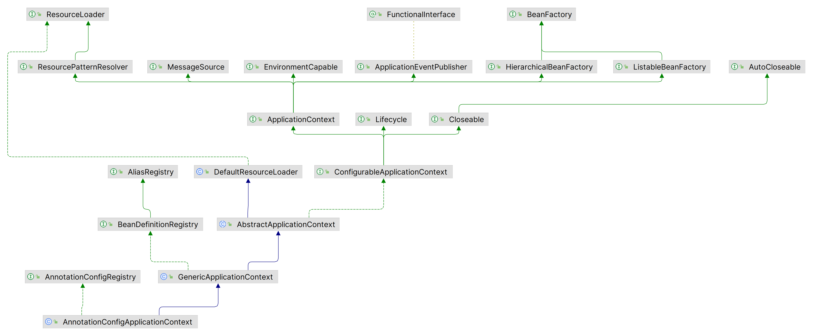
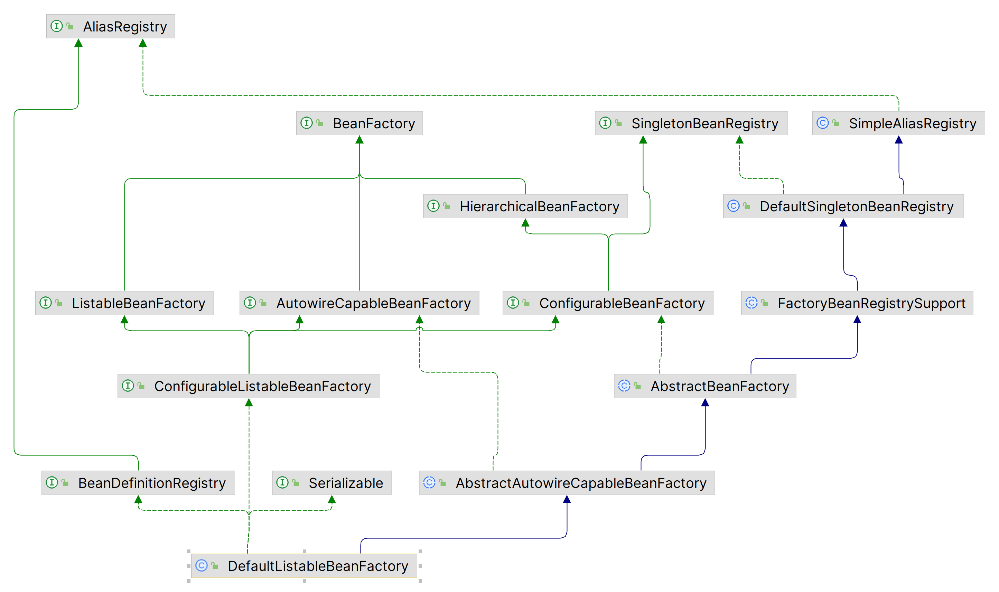

AnnotationConfigApplicationContext这个类是ConfigurableApplicationContext->ApplicationContext->BeanFactory的一个实现，如图：



那么，这个类中是如何获得Bean实例的？在它的父类AbstractApplicationContext中，实现了BeanFactory#getBean()，见下：

```java
//AbstractApplicationContext
@Override
public Object getBean(String name) throws BeansException {
	assertBeanFactoryActive();
	return getBeanFactory().getBean(name);
}
```

这个getBeanFactory()在AbstractApplicationContext中是抽象方法，在它的子类GenericApplication中实现如下：

```java
//GenericApplication
public GenericApplicationContext() {
	this.beanFactory = new DefaultListableBeanFactory();
}

@Override
public final ConfigurableListableBeanFactory getBeanFactory() {
	return this.beanFactory;
}
```

好，这个beanFactory字段，默认是DefaultListableBeanFactory类型的，我们来看一下：



最终，就是在这里进行获取Bean的了。
