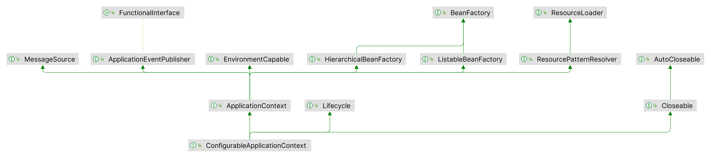
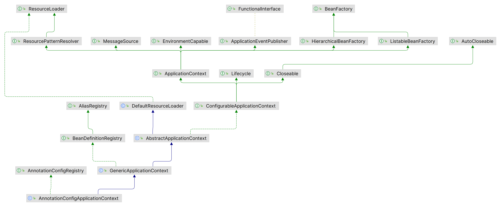

一个SpringBoot项目，是从下面的位置启动的：

```java
SpringApplication.run(T::class.java, *args)
```

这个方法最终会实例化SpringApplication并调用run()方法：

```java
//SpringApplication
public ConfigurableApplicationContext run(String... args) {
    long startTime = System.nanoTime();
    DefaultBootstrapContext bootstrapContext = createBootstrapContext();
    ConfigurableApplicationContext context = null;
    configureHeadlessProperty();
    SpringApplicationRunListeners listeners = getRunListeners(args);
    listeners.starting(bootstrapContext, this.mainApplicationClass);
    try {
        ApplicationArguments applicationArguments = new DefaultApplicationArguments(args);
        ConfigurableEnvironment environment = prepareEnvironment(listeners, bootstrapContext, applicationArguments);
        Banner printedBanner = printBanner(environment);
        context = createApplicationContext();
        context.setApplicationStartup(this.applicationStartup);
        prepareContext(bootstrapContext, context, environment, listeners, applicationArguments, printedBanner);
        refreshContext(context);
        afterRefresh(context, applicationArguments);
        //...
        listeners.started(context, timeTakenToStartup);
        callRunners(context, applicationArguments);
    }
    catch (Throwable ex) {
        //...
    }
    //...
    return context;
}
```

这里比较重要的几个步骤是：listener、environment、context

在这里，我们先讨论context。

我们知道，在Spring中，比较重要的两个接口时BeanFactory和ApplicationContext。其中ApplicationContext继承了BeanFactory接口，对其进行了一些扩展，比如方便的MessageSource访问，且ApplicationContext是启动时加载Bean而不是按需加载的。SpringBoot启动过程中，返回的时ConfigurableApplicationContext，即应用配置上下文，它继承了ApplicationContext和Lifecycle等，如下图：



通过上面的代码可以看到，context是通过createApplicationContext()方法实例化的，我们继续跟进：

```java
//SpringApplication
protected ConfigurableApplicationContext createApplicationContext() {
	return this.applicationContextFactory.create(this.webApplicationType);
}
```

最终调用了ApplicationContextFactory#create()方法，那么ApplicationContextFactory是什么？

通过名称可以判断，这个类是应用上下文工厂，即可以通过该工厂类去获取一个应用上下文。对于默认情况，它会返回一个默认工厂：

```java
//ApplicationContextFactory.java
ApplicationContextFactory DEFAULT = new DefaultApplicationContextFactory();
```

对于这个默认工厂，它的create()如下：

```java
//DefaultApplicationContextFactory
@Override
public ConfigurableApplicationContext create(WebApplicationType webApplicationType) {
    try {
        return getFromSpringFactories(webApplicationType, ApplicationContextFactory::create,
                this::createDefaultApplicationContext);
    }
    catch (Exception ex) {
        throw new IllegalStateException("Unable create a default ApplicationContext instance, "
                + "you may need a custom ApplicationContextFactory", ex);
    }
}

//上述方法会调用这里
private ConfigurableApplicationContext createDefaultApplicationContext() {
	if (!AotDetector.useGeneratedArtifacts()) {
		return new AnnotationConfigApplicationContext();
	}
	return new GenericApplicationContext();
}
```

我们注意到，最终在createDefaultApplicationContext()中创建了应用配置上下文，但是其中有一个判断。这个AOT是Ahead of Time，即提前编译，如果没有使用AOT，会创建AnnotationConfigApplicationContext，如果启用了，就创建GenericApplicationContext，个人猜测是因为AOT没有反射这些特性，注解就不需要了。整体的继承关系如下：



至此，我们已经创建了应用上下文。

那么，我们在AnnotationConfigApplicationContenxt是如何获取Bean的，请见[这篇文章](annotation-config-application-context.html)。
